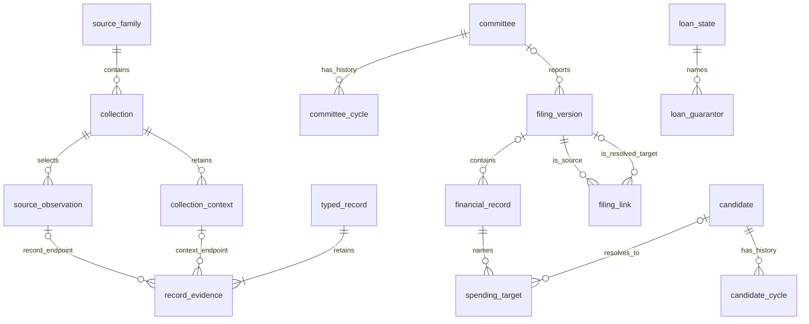
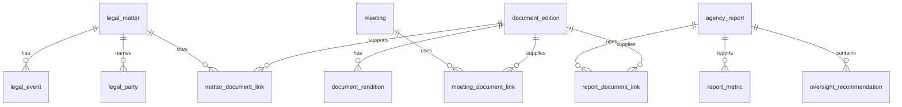

# FEC table ontology and relationships

Saved September 30, 2026. The existing FEC tables are the right foundation for
preserving source evidence and candidate/committee history. The proposed query
layer adds clear financial, filing, legal and agency row meanings so users can
answer questions without interpreting raw JSON themselves.

This document defines the concepts, keys, table grains and relationships for
that layer. A table's **grain** means what one row represents. Existing tables
are identified below; all other names are proposed logical datasets, not claims
of implemented schemas, populated files or public availability. Start with
views or small adapters over existing structures. Materialize new Parquet tables
only when the row meaning or measured query need warrants it.

**October 1 delivery update:** the selected retained subject tables are now
published; see the [reviewed release](research/fec-reviewed-release-2026-10-01.md).
This design retains proposed names and future semantics alongside implemented
concepts. Use the published manifests and table dictionaries for exact schemas.

The [R2 delivery checklist](fec-delivery-plan.md) owns the active retained
non-PDF scope. Additional acquisition, storage redesign and unqualified financial
semantics remain separate choices. PDF body processing remains deferred.

The September 30 review revisions add explicit correction/replacement rules,
record and collection-context evidence endpoints, and a compatible-release rule.
These remain proposed implementation requirements; the revision itself does
not qualify a current financial view or change any retained table.

## How the data becomes useful

What goes in is an explicitly selected source capture, file, archive member or
verified source release. SpicyDocs preserves native values and evidence.
SpicyRegs maps supported fields into useful subject tables, then applies explicit
rules when users need a current record or a financial total. What comes out is a
versioned query dataset with coverage and a route back to the exact evidence.
We check membership, fields, identifiers, joins, inclusion decisions and source
bytes independently of whether the output happens to load successfully.

There are three distinct levels:

| Level | Row meaning | Safe interpretation |
| --- | --- | --- |
| Source evidence | A source observation within a selected collection | The publisher supplied these values at this locator; multiple captures and representations may overlap |
| Typed subject records | A mapped reported record version, filing, matter, document edition or metric with a declared grain | Supported values have explicit columns and relationships; unknown fields still survive in the source record |
| Qualified views | Records selected under a named, versioned inclusion or interpretation policy | Totals and current-state answers apply only to the stated population, period and policy |

Do not collapse these levels into one universal financial-events table. A
receipt, a report total, an outstanding debt and a legal document have different
meanings and cannot share one summation rule. Conversely, do not create one
physical table per year or per download route when the same logical grain fits.

## Existing tables and their limits

| Existing table or view | Grain and identity | Keep and extend |
| --- | --- | --- |
| `fec_source_catalog` | Official source-family entry | Discovery routes, access methods and definitions. A catalog entry does not mean its data has been acquired. |
| `fec_collections` | Explicitly selected collection or caller coverage disposition; `collection_id` | Scope, profile, counts, outcomes, coverage limits and evidence pins. Preserve provider results separately from caller dispositions. |
| `fec_source_records` | Source observation identified through collection, source record and exact locator | Complete provider JSON, metadata, assets, embedded bodies, digest, URL and observation time. Keep all source fields and physical multiplicities. |
| `fec_relationships` | Source-reported role/association or explicit absence observation | Keep source and target identifier status, name-only values, cycle, field evidence and conflicting statements. Empty states are not graph edges. |
| `fec_committees` | Observed current committee profile keyed by committee ID in a selected generation | Current reference lookup; not a dated history or a universal assertion about every committee. |
| `fec_committee_history` | Committee × source cycle in a selected generation | Names, type, treasurer, address, organization, candidate and other literal attributes as reported in that cycle's master. |
| `fec_candidate_history` | Candidate × source cycle in a selected generation | Name, party, office, district, election year, status, address and principal committee. |
| `fec_collection_cycles` | Collection with a cycle derived from its captured bulk-directory URLs | Existing view only identifies cycles stated by `bulk-downloads/<year>/`. It does not resolve every API, legal or agency period. |
| `fec_relationship_evidence` | Relationship observation with possible companion matches | Existing view exposes lookup ambiguity and digest comparisons. A matching recorded digest is not a fresh verification of the original bytes. |

The implemented source-record columns are:

```text
collection_id, source_family, profile, source_record_id,
committee_id, candidate_id, filing_id, legal_doc_id, audit_case_id,
source_sha256, source_url, observed_at,
source_locator_json, metadata_json, assets_json,
embedded_bodies_json, source_record_json
```

These are currently string-oriented fields. Financial values often remain in
JSON. Existing candidate and committee history columns are also VARCHAR; this
proposal does not silently migrate them to a new storage type.

Three existing details constrain new joins:

- `committee_id` on a transaction source record can identify the reporting
  committee. It must not automatically become the recipient or counterparty.
- The observation builder can lift source `sub_id` into `filing_id`. That field
  is not universally a report number or a submitted filing identifier. New
  filing joins must examine the native namespace and fields.
- `(collection_id, source_record_id)` is the normal companion lookup, but
  consumers must still check cardinality. The existing evidence view preserves
  ambiguous matches. Include the exact locator, digest and selected generation
  when proving a particular parent. Standalone relationship mapper outputs may
  lack the collection/record coordinates supplied by the retained-input builder.

See the current dictionaries for
[source records](tables/fec_source_records.md),
[collections](tables/fec_collections.md),
[relationships](tables/fec_relationships.md),
[candidate history](tables/fec_candidate_history.md) and
[committee history](tables/fec_committee_history.md).

## Identity and value rules

| Concept | Proposed rule | Why it matters |
| --- | --- | --- |
| Candidate and committee identity | Preserve literal FEC IDs as strings, with native spelling and mapping status. Join history with both ID and cycle when answering a cycle-specific question. | Names change and cycle rows have different attributes. Syntax validity alone does not prove a target exists. |
| Source observation identity | Use collection, source record, digest and physical locator/subrecord path; qualify uniqueness in the selected generation. | Repeated rows, duplicate files, headers and versions remain observable. A source `sub_id` need not be globally unique across routes. |
| Typed record identity | Use a deterministic, namespaced `record_id` for the declared table grain, with an explicit identity version. Initially keep distinct source observations distinct. | A typed row is not automatically one economic event. Equivalence needs separate evidence. |
| Filing identity | `filing_key` identifies one submitted version within an authority and source identifier namespace. Keep source row ID, report/file number, transaction ID and archive filename in separate fields. | Numeric resemblance cannot justify joining unrelated identifiers. |
| Matter identity | `matter_id` includes authority, matter type and native case identifier namespace. | An advisory opinion, audit and enforcement matter can reuse similar numbers. |
| Document identity | A document edition/version has its own identity; a content digest identifies bytes. | Identical bytes can appear in different document contexts, and one document may have several renditions. |
| People and organizations | Retain names, addresses and native IDs as reported. A candidate or committee ID does not create a universal person/organization registry. | Name matching alone cannot merge donors, payees, committee sponsors or legal parties. |
| Monetary values | Exact decimal storage after source-specific mapping, with currency and amount meaning. Preserve original text and scale in evidence; do not round excess precision silently. | Floating-point sums, overflow and lost signs can change financial conclusions. |
| Dates and periods | Distinguish transaction, dissemination, submission, reported-effective, fiscal, election and capture dates. Preserve raw values and parsing status. | Observation time is not the date an event occurred. Candidate election year is not always source cycle. |
| Unknown values | Keep unknown, source NULL, empty, unreported, unsupported, refused and deferred distinct through source values plus mapping status/reason. | A SQL NULL alone cannot explain why a value is absent. |
| Source authority | Retain official, unofficial archive, third-party and derived authority labels on evidence and interpretation. | An inferred association must not be presented as an FEC-stated relationship. |

A reproducible typed observation key can hash a versioned encoding of table
family, source authority, collection/record identity, source digest, locator and
subrecord path. This is a proposed recipe to qualify in FR03, not an existing
identifier scheme. Do not include machine paths, ingestion order or wall-clock
run time. Mapping changes have their own version; record identity changes only
when its declared grain or source identity changes. Cross-generation references
also retain the generation pin and table name.

One source record may yield several typed child records. For example, a filing
can contain several loan guarantors. Child identity must include the native
child identifier or exact child path/ordinal. A later policy may prove records
from two collections equivalent, but it must retain both observations and the
reason for combining them.

## Common fields and evidence links

These are proposed reusable field groups, not a requirement to copy every field
into every table. Keep family-specific meanings explicit. Prefer narrow serving
tables with evidence links over copying full native JSON into every output.

| Field group | Fields | Rules |
| --- | --- | --- |
| Row identity | `record_id`, `identity_version` | Unique within the declared table and generation; stable for unchanged selected observations |
| Native identity | `source_record_identifier`, `report_number`, `transaction_id`, `source_namespace` | Strings; preserve native values separately; only fields that apply to the family |
| Evidence | `evidence_endpoint_kind`, `collection_id`, conditional `source_record_id`, exact locator and witness digest; resolved generation pin in publication metadata | Use kind-specific requirements below; dictionary/context witnesses do not require a source-record row |
| Filing association | `filing_key`, `filing_link_status`, `form_type`, `schedule_type` | Nullable when the filing is not resolvable; absence never drops an otherwise valid record |
| Reporting party | `reporting_committee_id` or reported entity fields, `reporting_party_status` | Do not force every spender, inaugural entity or legal party into a committee ID |
| Period | `source_cycle`, `candidate_election_year`, `reporting_period_start`, `reporting_period_end` | Separate source concepts; do not populate unrelated fields from a guessed year |
| Amount and date | Named date fields, `amount`, `currency`, `amount_kind`; raw values reachable through evidence | Use a transaction date only where the source has one; balances, awards, allocations and aggregates retain their own meanings |
| Source flags | `amendment_indicator`, `memo_indicator`, source type/category codes | Literal flags with versioned definitions; no blanket rule that every flag has the same effect |
| Source representation and corrections | `source_representation_role`, `correction_operation`, proven base/target references, ordering/window and applicability status | Distinguish snapshot, insertion, deletion and other correction inputs. Inherit supported roles from source evidence, never from amount sign or an ordinary amendment flag alone. |
| Mapping result | `mapping_version`, `mapping_status`, `mapping_reason` | Typed success, partial interpretation and unsupported fields are inspectable; unsupported source values survive |

Proposed `fec_record_evidence` links a typed record or typed entity version to
each supporting record or collection-context witness. Its grain is one explicit
association between a typed target key and a witness. All links identify the
target table/key, generation references, `evidence_endpoint_kind`, source
collection, exact locator, witness digest, `evidence_role` and
mapping/equivalence rule version. Check the complete association for uniqueness.

| Endpoint kind | Required source coordinates | Validation |
| --- | --- | --- |
| `source_record` | Source table `fec_source_records`, `collection_id`, `source_record_id`, exact row/subrecord locator and source digest | Resolve within the selected source generation and retain all candidate matches until locator/digest proves the witness. A missing or ambiguous parent cannot silently become a first match. |
| `collection_context` | Source table `fec_collections`, `collection_id`, the context-bearing column, exact JSON pointer within that column, original witness digest and its native locator | Resolve the declared context in the selected collection generation; verify its original capture/dictionary through the retained evidence. `source_record_id` is NULL because this witness has no source-record endpoint. |

The existing official HTML dictionaries illustrate the second kind: definitions
can live in `collection_outcome_json` at `/tableFieldDefinitions`, with native
dictionary coordinates and a different source digest from the financial row.
Link both witnesses separately. Do not invent a dictionary record or replace
the financial row's digest with the dictionary's digest. Headers already present
as source records use the first kind. Unknown endpoint kinds refuse validation;
a NULL record ID is valid only under the explicit context rules.

Electronic filing definitions use a compact `fec_filing_definitions` table:
one pinned source layout, its literal version/form and ordered field definitions.
Consumer mapping versions and record-type selectors remain with the reviewed
mapping, so several mappings can share the same source definition. Each financial row retains `definition_set_id`
and its native file-header address. The normalized
`fec_filing_definition_evidence` associations resolve workbook cells within
`collection_outcome_json` at
`/receiverDisposition/callerContext/facts/parsing/facts`. A derived evidence
view joins those witnesses to financial rows. This preserves both source
addresses without repeating the full workbook definition on every transaction.
Layout identity and field mapping do not assert submission conformance,
amendment scope or eligibility for financial totals.

Roles distinguish a primary row, dictionary/header, corroborating representation,
correction and amendment evidence. The evidence dataset can start as a derived
view. For a stored association, each endpoint states `generation_scope=self`
or `external`: an external endpoint requires its exact already-sealed generation
pin; a self endpoint resolves the containing generation pin from publication
metadata at read time and stores no final self digest. Validate the target key
against that resolved generation. Never embed a generation's final content hash
in one of its own members. A separately sealed link artifact can instead refer
to completed target/source generations. Preserve unresolved endpoints explicitly
until qualified; do not discard ambiguity to obtain a convenient foreign key.

Proposed `fec_coverage` is a view over existing catalog/collection context plus
mapping and publication receipts. Its grain is a declared family/selection/period
and stage, not an inferred row for every possible year. Expose source authority,
date basis, requested scope, expected membership if known, observed membership,
acquisition, parsing, mapping, interpretation, publication and body/search
status, limits, last observation and evidence pins. Unknown expected counts stay
NULL. New interpretation statuses must not overwrite provider outcomes.

## Candidate committee and filing tables

Keep the existing candidate/committee histories and reported relationships.
Do not introduce new master tables merely to draw an entity diagram. A candidate
or committee concept can be resolved from the existing identifiers, with the
selected cycle and source attributes explicit.

| Proposed dataset or extension | One row and key | Important fields and relationships | User value |
| --- | --- | --- | --- |
| `fec_filings` | One retained metadata observation of a submitted report/statement version; `record_id`, with nullable logical `filing_key` | Authority/namespace/native filing ID, reporting committee/entity, form, period, submitted/received dates, source amendment indicator, original URL and evidence. Several observations can describe the same native filing key; group that key before a reference join and retain the observations. Native representations link only when identity is proven. | Find the filed version behind a fact and inspect corrections without treating repeated API captures as separate submissions. |
| `fec_filing_links` | One evidenced directed relation between filing versions; namespaced link ID or unique endpoints/type/evidence | Source/target filing keys, relation type, native reference and resolution status. Amendment links also state replacement mode/scope, affected report/schedule/record keys, membership-completeness evidence and policy version. Unknown scope remains explicit. | Follow amendment and related-document chains without guessing from timestamps or treating every omitted row as deleted. |
| `fec_relationships` extension | Existing source-reported relationship observation grain | Candidate authorization, principal campaign committee, other authorized committee, connected organization, affiliation, leadership sponsor and lobbyist/registrant roles; dates only when reported. | Explain who is connected to whom, in what role, and according to which record. |

Forms 1 and 2 feed filings plus supported identity and relationship fields.
Electronic, transcribed paper and unofficial Senate originals can feed the same
logical filing tables while retaining source format and authority. A current
committee API profile is not a replacement for cycle history. The selected
local API census must not overwrite a broader public committee reference table
with a smaller population merely because it was processed later.

## Financial record tables

Unless specified otherwise, each proposed financial row is **one reported
record version or observation**, keyed by `record_id`. Each carries the
applicable common fields and evidence above. An entity/year/amount tuple is not
a sufficient transaction key. Source mappings decide whether a record belongs
in a particular family; do not route every row from a mixed file to one table.

| Proposed table | Exact grain | Family fields and links | Why separate it |
| --- | --- | --- | --- |
| `fec_receipts` | Itemized receipt version | Recipient/reporting entity, contributor name/type and native identifier, date, amount, employer, occupation, receipt type, account, filing | Supports contributor analysis while preserving different receipt types and reported identities. |
| `fec_disbursements` | Itemized payment version | Reporting entity, payee name/type/native identifier, date, amount, purpose/category, account, filing | Supports payee and purpose queries; operating expenses and other payment types keep their distinctions. |
| `fec_intercommittee_transactions` | Reported committee transaction version | Reporting committee, other committee or unresolved native reference, transaction type, reported direction, date, amount, filing | Prevents assumed sender/recipient roles and preserves the two sides' reporting evidence. |
| `fec_independent_expenditures` | Reported independent-expenditure record version | Spender, payee, amount, expenditure date, dissemination date, report type, communication reference, filing | Separates outside spending from contributions and from the timeliness of its reports. |
| `fec_electioneering_communications` | Source-defined communication/report record version | Reporting entity, native communication/report identifier, dates, amount and its basis, filing | Preserves report-level versus payment-level amounts; nested receipts/payments become separately identified child rows only after mapping. |
| `fec_communication_costs` | Reported communication-cost record version | Organization, communication type, covered period/date, amount and amount basis, filing/report reference | Keeps this disclosure's meaning distinct from independent expenditures. |
| `fec_spending_targets` | One spending-record to candidate association | Source spend table and record ID, candidate ID or native/name-only target, support/oppose code, target status, explicitly allocated amount if supplied, evidence | Supports several targets without multiplying a spending record's full amount. |
| `fec_loans` | Loan state as reported in a filing/period | Reported loan key, lender/borrower, original amount, opening/closing balance, period activity, terms and due date | Distinguishes borrowing and repayments from a repeatedly reported outstanding balance. |
| `fec_loan_guarantors` | One guarantor association with a reported loan state | Loan record ID, guarantor name/native ID, guaranteed amount, source child identifier/ordinal | Preserves multiple guarantors without duplicating the loan principal. |
| `fec_debts` | Obligation state as reported in a filing/period | Creditor/debtor, obligation identifier, purpose, opening balance, incurred amount, payments and closing balance | Supports debt-state questions without treating each period's balance as new spending. |
| `fec_coordinated_party_expenditures` | Schedule F expenditure version | Party committee, candidate, payee, date, amount, purpose, filing | Keeps coordinated party spending distinct from independent spending. |
| `fec_allocated_disbursements` | Schedule H4 payment/allocation version | Reporting committee, payee, purpose, date, total, federal share, nonfederal share, allocation basis, filing | Prevents counting a total and both component shares as separate expenditures. |
| `fec_bundled_contributions` | Bundler/recipient amount for a reported period and version | Recipient, bundler identity as reported, period, amount, filing | Represents reported bundling aggregates, not invented individual donor transactions. |
| `fec_inaugural_donations` | Itemized Form 13 donation version | Inaugural reporting entity, contributor, date, amount, filing | Keeps inaugural donations and their reporting structure distinct from campaign committee receipts. |
| `fec_public_funding` | Source-defined award or payment event | Recipient, program, event kind, amount, date, payment stage, native identifier | Makes public funding inspectable without adding an award and its disbursement as two payments. |

National-party special accounts are explicit account fields in the appropriate
receipt, payment and summary tables; create another table only if a source has a
different grain. Small inaugural contributor aggregates belong in
`fec_contribution_aggregates`, not in the itemized donations table.

The retained bulk bundling file supplies recipient-period summaries without
individual bundler identity. Map those rows to `fec_reported_financial_summaries`
with separate quarterly and semiannual measures. Populate
`fec_bundled_contributions` only where retained source records actually identify
the bundler/recipient association. The
[execution register](research/fec-retained-delivery-execution-2026-09-30.md)
records this source-shape distinction.

The retained electioneering CSV uses candidate-associated disbursement rows.
Preserve that observation grain and the publisher's calculated candidate share;
similar dates, payees, images and amounts do not establish a shared event key.
Until event identity is qualified, its full disbursement amounts are not
additive across candidate rows. Derived `fec_spending_targets` may expose the
reported association and the FEC-calculated allocation while retaining unresolved
event identity. The supplied share is a publisher calculation, not a claim that
the filer reported that allocation.

Electioneering reports or other source records may contain nested disbursement
or donor details. Keep the parent report ID and exact child identity when
mapping those details to suitable receipt/payment tables. Preserve the parent
reported total separately; never add it to its itemized children. If the common
table's grain cannot represent a child faithfully, define and qualify a specific
child table before adopting it.

### Financial relationships

This diagram shows logical concepts. `candidate` and `committee` refer to
existing identities; `financial_record` stands for the separate family tables,
not a proposed universal physical table. Optional links apply only when
reported identifiers resolve.



Each evidence association selects exactly one of the record or context endpoint
kinds; the two optional diagram edges are alternatives, not two required parents.

Each financial record can be linked to zero or one identified filing version
in its mapping; an unresolved link must remain visible. Different records can
be proven representations of the same native transaction version only under an
explicit rule. A many-to-many evidence association supports that proof without
destroying the original observations.

## Summaries election context and reference data

| Proposed table or shared structure | One row and key | Important fields | User value |
| --- | --- | --- | --- |
| `fec_reported_financial_summaries` | Entity × source-defined period × summary type × source version; `summary_id` | Entity reference, period, cycle, summary basis, receipts, spending, cash, debt and source-specific measures | Use reported totals directly while retaining definitions and amendment history. |
| `fec_contribution_aggregates` | Reported group within a population, period and version; `aggregate_id` | Entity, period, dimension set such as state/ZIP/size band, bucket definition, amount and supplied count | Compare geography and contribution size without pretending aggregates identify transactions. |
| `fec_campaign_statistics` | Defined metric for a population/period/source edition; `metric_id` | Population definition, measure definition, dimensions, period, value, unit, edition | Compare campaign activity under explicit statistical definitions. |
| `fec_election_results` | Candidate/result entry within a source-defined contest and result edition; `result_id` | Contest, jurisdiction, date, office, candidate as reported, votes, result status, optional evidenced FEC candidate mapping | Connect finance to the correct election and preserve unresolved identities. |
| `fec_calendar_events` | Election, deadline or calendar event occurrence; `event_id` | Event type, date/time semantics, jurisdiction, filer class, report/contest reference | Explain which deadlines and elections apply to a record. |
| Reference definitions | Versioned definition/code value with source applicability | Source field/code, definition, layout/version, period, authority, evidence | Interpret codes without silently applying today's dictionary to historical files. |
| Quality notices | Source-issued notice and explicit record/population links | Notice type/date, reported scope, native references, status and evidence | Show source quality warnings without converting a notice into a proved identity match or allegation. |

Use existing RefSpec/reference structures where their grain fits. No new global
vocabulary service is required for this work. Foreign-key fields can remain
unresolved while their literal values and definitions stay queryable.

For retained financial summaries, source-specific monetary measures are stored
as typed entries on the summary row: native field name, raw value, exact decimal,
unit and conversion state. The derived
`fec_reported_financial_summary_metrics` view exposes one entry per summary and
native measure, preserving the parent key and evidence. This avoids repeating
stored provenance and avoids silently equating similarly named measures from
different source layouts. Neither the summary table nor the measure view adds
overlapping periods or selects a latest edition automatically.

Reported totals and computed totals are separate outputs. Quarterly, election
cycle and year-to-date summaries often overlap; they cannot be summed together.
A computed total identifies its source population, period, policy version,
included rows and exclusions. Differences from reported totals may reflect
unitemized activity, scope, timing or definitions; retain the reconciliation
rather than forcing numerical agreement.

## Legal documents and agency tables

Legal metadata, source text and case history need separate grains. Reuse the
shared DocSpec document catalog and text structures if their edition, body and
evidence semantics fit. The existing SpicyRegs `documents` table is not assumed
to be generic enough merely because of its name. Inspect it before reuse.

| Proposed table or shared structure | One row and key | Important fields and links | User value |
| --- | --- | --- | --- |
| `fec_legal_matters` | Source-defined legal matter; source-scoped `matter_id` | Type such as advisory opinion, enforcement, administrative fine, ADR, audit, litigation or rulemaking; native ID, title, stated dates, status and outcome | Find the case or proceeding without conflating similar identifiers. |
| `fec_legal_events` | Dated source event/observation in a matter; `event_id` | Matter, event type, date/date precision, description, related document, evidence | Reconstruct the stated sequence of events; unknown dates remain unknown. |
| `fec_legal_parties` | Party-role assertion within a matter; `party_role_id` | Matter, role, reported name, native entity ID if supplied, resolution status, evidence | Find complainants, respondents, requestors and other roles without inferred identity merges. |
| `fec_audit_findings` | Source-defined finding or finding version; `finding_id` | Audit matter, category, text, amount if applicable, stated disposition and supporting document | Compare findings while preserving the source's categories and versions. |
| Shared document catalog and text | Document edition plus separately identified content/rendition | Native ID, type, title, dates, URL, content digest, media type, authority, body status and retained text when available | Discover and read the right edition; distinguish metadata-only records from available bodies. |
| Shared document links | One evidenced document-edition association with a matter, filing, meeting, report or other document | Endpoints, relation type, source assertion and evidence | Reuse a document in several contexts without duplicating its body or inventing identity equivalence. |
| `fec_meetings` | Meeting occurrence; `meeting_id` | Date, type, title, agenda/minutes documents, linked matters with evidence | Follow deliberation and decisions across documents. |
| `fec_agency_reports` | Report edition; `report_id` | Type, title, fiscal year/period, publication date, document references and source authority | Discover FOIA, budget, performance, privacy, procurement and oversight publications. |
| `fec_report_metrics` | Measure observation within a report edition; `metric_id` | Report, measure definition, dimensions, period, exact value, unit, source location | Compare agency performance without confusing structural extraction with a defined measure. |
| `fec_oversight_recommendations` | Source-defined recommendation or observed recommendation state; `recommendation_record_id` | Stable source recommendation key where given, report, recommendation text, responsible party, reported status and status date | Follow corrective action while preserving changing status observations. |
| Existing law and regulation structures | Source-defined legal provision/edition | Explicit FEC matter/document references with source authority and evidence | Connect guidance or enforcement to cited law without duplicating the stack's legal sources. |

Source updates must retain prior matter/document observations. Where a current
matter profile or current recommendation status is useful, select it through a
documented view and preserve the source event/observation history. A native
mutable case ID alone does not justify overwriting conflicting prior facts.



The diagram's document-link names describe relationship types; reuse one shared
link structure if it enforces the same grains. A matter can reference many
documents and a document can serve several matters, meetings or reports.
Digest equality can share stored content without merging those identities.

PDF-linked records carry an explicit deferred body-processing state. Existing
pre-deferral evidence may remain discoverable without triggering new parsing.
HTML, XML, Word and spreadsheets can provide native text and structure, but a
successful extraction does not automatically qualify a legal fact or report
metric. Preserve exact context, headings, units and definitions for each mapping.

## Qualified views and financial policy

Useful query views are proposed as `fec_current_receipts`,
`fec_current_disbursements` and corresponding family-specific views, plus narrow
committee/candidate totals where justified. The exact names can follow current
repository conventions. Their documentation must expose policy ID/version,
generation pins, population, as-of meaning, unresolved records and exclusions.
They must not quietly replace the source-observation tables.

A proposed inclusion-decision dataset/view records the policy, table/record ID,
status such as included/superseded/removed/duplicate/unresolved/outside-selection,
reason, applicable correction/amendment evidence and any replacing/equivalent
record ID. A removal may be justified by a complete filing/schedule replacement
without any replacing transaction row; retain that scope's identity and complete
membership proof. Maintain decisions at row level where feasible; a partition
rule must identify exact membership. Distinguish detail-display eligibility from
eligibility for a stated total. If applicability or replacement scope remains
unknown, preserve detail and refuse a qualified current-total claim for the
affected population; a snapshot-only result must state its narrower meaning.

### Correction streams

The immediate retained selection includes publisher insertion and deletion
files. These are not ordinary additional receipt snapshots. The mapped source
role must retain its evidence and distinguish `snapshot`, `insertion`,
`deletion`, `other_correction` and `unknown`. Preserve literal amount/type values:
a deletion can carry a positive amount and an ordinary amendment indicator.
Its operation comes from qualified source selection/definitions, not a guessed
negative sign, filename label or capture timestamp.

Before applying a correction, the policy must establish the exact compatible
base snapshot/selection, native target identity and multiplicity, publisher
ordering or applicability window, and which operations the base already
contains. Store those pins and the rule version in the decision evidence. If
the base or applicability is unknown, keep the correction as source detail and
mark current selection unresolved; do not silently ignore it or add its payload
as money. If evidence proves the selected snapshot already incorporates the
operation, retain the witness but exclude repeat application with that reason.

Build the result deterministically from pinned inputs. Record operation identity
and exact affected membership so a repeated correction cannot change the result
twice. Conflicting order, ambiguous targets or an unexpectedly absent target
must refuse qualification unless a source-supported rule explains that state.
Reconcile the resulting record multiset, not merely a matching sum. These rules
belong to FR03/FR07/FR08 now, and later historical mappings extend them.

### Amendment replacement scope

A known amendment chain is necessary but insufficient. Each selected policy must
state whether the amendment replaces a complete report, a complete schedule,
specified records, or an unknown scope, and whether its captured membership is
complete for that scope. Keep `replacement_mode` as complete/partial/unknown,
the affected scope keys, filing mode, source definitions and supporting evidence.
File format alone does not prove these facts.

FEC guidance distinguishes complete electronic report resubmission from paper
amendments that need not repeat correctly reported transactions. It also notes
that an electronic filer may amend an earlier paper report on paper. Apply the
source/form-specific rule rather than a universal latest-filing rule.
See [FEC amendment guidance](https://www.fec.gov/help-candidates-and-committees/filing-amendments/).

For a complete replacement with proven membership, an earlier row omitted from
the replacement can be removed under that scope's rule even though no replacement
row names it. For a partial amendment, preserve unaffected prior rows; change or
remove only the source-supported affected records. Without complete membership
or known replacement scope, absence is not deletion evidence. Preserve the prior
and amended observations and report the affected current selection as unresolved.

### Mandatory financial acceptance cases

| Case | Required treatment | Independent check |
| --- | --- | --- |
| Same individual-contribution population in main and date-partition files | Preserve both physical sources; select one representation or use proven row-multiplicity equivalence for a stated population | Full multiset comparison; counts alone are insufficient |
| Positive-amount row in a publisher deletion stream | Preserve its literal amount and deletion role; remove a proven target from a compatible base, without adding a receipt or fabricating a refund | Assert exact removed membership and operation evidence, not just a smaller total |
| Insertion already reflected in the selected snapshot | Keep both witnesses and exclude a second application only when base applicability is proven | Expected row multiplicity is unchanged; an equal amount alone does not prove identity |
| Correction with unavailable base, ambiguous target or unknown ordering/window | Preserve detail and expose unresolved current selection | Qualified current-total view refuses the affected scope; no default application or silent omission |
| Repeated or out-of-order correction input | Deduplicate an operation only by proven operation identity/applicability; reject unexplained order conflicts | Reapplying the same operation leaves identical membership and decisions; conflicting ordering refuses qualification |
| Original amount $100, amended to $150, with the amendment captured in two formats | Preserve all observations; a qualified current view reports $150 once only after both amendment and representation equivalence are proven | Retained source identifiers and chain, raw/output witnesses and a policy decision for every copy |
| Original has A=$100 and B=$200; complete replacement contains only A=$150 | With complete scoped membership and the applicable replacement rule, remove B by omission and select A=$150 | Exact selected set is A only; B's removal cites the replacing filing/scope rather than a fabricated replacement B |
| Same original; partial paper amendment corrects only A to $150 | Preserve unaffected B and update A under the evidenced partial scope | Exact selected set is A=$150 and B=$200; no general delete-by-omission rule |
| Replacement mode known but affected report/schedule capture incomplete | Keep all evidence and leave absence-based decisions unresolved | The complete-chain and changed-amount checks alone cannot qualify a current total |
| Incomplete or ambiguous amendment chain | Retain records and expose unresolved current selection | No latest-capture-time shortcut; verify the query does not present an unjustified authoritative total |
| Memo/subtotal/attribution rows | Preserve detail; decide eligibility per source family and analytic purpose | Source flags and definitions support each rule; do not assume one blanket memo rule answers all queries |
| Refunds, negative amounts, returned or reattributed contributions | Preserve signs and native types; define gross/net views explicitly | Exact decimal arithmetic and source-supported treatment |
| One spend names several candidates | Store target links separately; retain unallocated full amount on the spend | Totals over spending records remain unchanged after target discovery; full amount is not summed once per candidate |
| Loan or debt repeated across reports | Distinguish period activity from stock/balance | Period-end balance selects the intended snapshot; it is not the sum of all reported closing balances |
| Total payment plus allocated shares | Keep whole and component fields with their basis | Validate shares where source definitions require it; never sum the total and its parts |
| Two committees report different sides of a transfer | Preserve both reported observations; consolidate only under an explicit flow analysis rule | Counterparty, direction, dates, amount and identifiers support the relationship; neither side is silently dropped |
| Summary and itemized records overlap | Keep source-reported and derived totals separate | Reconcile compatible periods/populations and state legitimate residuals such as unitemized activity |
| False/fictitious notice or quality warning | Link the notice and its source scope | No automatic donor identity inference, accusation or exclusion beyond the source-supported policy |

The retained `oppexp26` layout has a field-count mismatch between observed rows
and published field names. Its raw fields remain usable as evidence; typed
financial columns must wait for a qualified mapping or an explicit refusal.
Do not shift columns until values look plausible. Historical layouts also need
versioned mappings rather than one latest header applied to every year.

## Cross-source joins and query cardinality

| Join | Intended relationship | Required guard |
| --- | --- | --- |
| Source family to collection | One to many | Family is discovery classification, not proof of complete acquisition |
| Collection to source observation | One to many | Retain collection scope and exact source coordinates |
| Typed record to source evidence | One to many, potentially many to many across proven representations | Resolve record or collection-context endpoints by kind; check generation, locator and witness digest without invented source-record IDs |
| Committee/candidate to cycle history | One to many across cycles | Join on cycle for dated attributes; joining on ID alone can multiply rows |
| Filing version to financial record | One to many, with unresolved filing references allowed | Use the native filing namespace; never join source `sub_id` blindly to file number |
| Filing version to related filing version | Directed many-to-many links | Preserve relation type, chain evidence, ambiguity and unresolved targets |
| Spending record to candidate | Many to many through target associations | Aggregate at the spend grain or an explicit allocation grain |
| Loan state to guarantor | One to many | Loan amount stays on the loan state; each guaranteed amount retains its own meaning |
| Matter to document | Many to many through evidenced links | Preserve document edition and matter namespace |
| FEC candidate to legislative member | Evidence-backed crosswalk, potentially temporal or ambiguous | Use existing `members.fec_ids_json` and `bioguide_id` only with its source authority and coverage |
| Legislative member to vote | One to many in the selected legislative population | Do not imply full House/Senate or historical coverage from a bounded existing vote selection |

The candidate-to-member bridge can support a money-and-votes investigation, but
does not by itself establish funding attribution, causality or a scoring rule.
Current retained legislative coverage is bounded; qualify the exact member and
vote generations before making cross-source coverage claims. Existing
`org_committee_links` contains name-based candidate matches and must remain
distinguishable from FEC-reported relationships.

Queries should first select the intended fact grain and period, then attach
descriptive dimensions. For amounts, compare row multiplicity and sums before
and after each join. A many-to-many relationship is useful information; it is
not permission to sum duplicated fact rows.

## Storage and publication

The typed application is greenfield. Implement its new schemas and queries
directly, with no legacy code compatibility or migration layer. Source-format
mapping remains necessary for the retained inputs. Release pin checks below
verify the data and interpretation used together; they do not support old APIs.

Use immutable raw blobs shared by digest, typed Parquet datasets where useful,
and versioned SQL views for interpretation. Partition large financial outputs
by the source cycle or another source-supported bounded selection while keeping
one logical schema. Avoid one wide universal table, one table per year, and
duplicated raw JSON in every subject table. Measure query cost before adding
indexes, copies or materializations.

### Release compatibility rule

The proposed first typed release uses one new `fec-query` family for the selected
typed tables and any stored inclusion/evidence associations that must advance
together. Its first sealed generation states complete selected membership;
unacquired families do not get invented empty outputs. Subsequent table additions
use the existing explicit membership migration. Existing observation, candidate
history, committee history and current-committee families keep their ownership
and independent refresh paths.

For each qualified view, the release must list the exact generations/table
digests of every source and identity dependency it actually reads, the typed
family pin, and the qualified mapping, SQL/policy, dictionary and definition
identities. The default compatibility rule is exact-pin equality, not merely
equal columns, overlapping IDs or one captured publication index. Reusing the
existing per-family publisher does not create this semantic check automatically;
SpicyRegs must implement it before enabling the proposed qualified views.

The small immutable release dependency receipt contains:

| Entry | Required information |
| --- | --- |
| Output membership | Table names, owning families, final generation/table pins and required schemas |
| Per-view dependencies | Each actual source/identity table and required pin; exact matching rule and the scope affected by a mismatch |
| Interpretation | Mapping and identity versions, SQL/policy definition digests, dictionary and source-definition digests, population/as-of meaning and acceptance receipt pins |
| Recovery | Source archive pin, retained generation dependencies, consumer image digest, code revision/build identity, package versions and rollback set |
| Serving selection | Receipt format/version and a digest pinned by deployment configuration; runtime attestation of the selected image/code and interpretation identities |

Seal the table generations, archive and consumer image before finalizing this
receipt. Store it separately by digest through the existing immutable evidence
storage path; do not put it in a generation whose digest it contains. Inject the
receipt digest through deployment configuration after image build rather than
creating an image/receipt hash cycle. Required older generations, archive,
receipt and image must remain retained for the promised recovery/rollback period.

At connection creation and refresh, resolve the captured table pins and running
interpretation identities against this pinned receipt **before** registering a
qualified view. A missing or mismatched dependency, policy, dictionary or consumer
image disables/refuses that affected qualified view with the precise reason.
Unrelated qualified views with satisfied dependencies and raw detail queries can
continue; raw queries do not inherit a qualified-current label. A previously
captured compatible connection may finish using its immutable set and reported
pins. It must not combine newer data into that connection.

If a parent advances independently, rebuild/requalify the affected typed release
against it before issuing a new receipt, or keep the old qualified view disabled
on new connections. The first implementation does not silently load historical
parents or accept a newer parent because its schema matches. Qualified query
responses expose the release receipt digest, actual table/parent pins, policy
and definition digests and running consumer identity. These identities allow
recovery of the meaning of a result as well as its Parquet bytes.

FR08 checks the reader behavior locally using a candidate receipt. FR12 prepares
the final dependency receipt and pinned consumer image/configuration; FR13
publishes and deploys that matched selection or proves an existing deployment
already matches. Publishing R2 tables alone does not deploy SQL views or
descriptions. Test parent advancement between build/publication/refresh, consumer
policy drift, mismatch refusal and rollback to a retained compatible set. A
rollback must restore all affected pins/code/configuration before enabling the
view, without overwriting unrelated families. Documentation-site publication
remains a separate selected task.

### Incremental implementation

Implement the model incrementally through the delivery plan:

1. Keep the existing evidence/history schemas and their sealed outputs intact.
2. Pass FR02's measured resource checkpoint, then qualify direct source mappings
   on bounded samples before full selected fields. Define keys, typed values,
   correction roles, record/context evidence endpoints and explicit refusals.
3. Add filing and identity joins before relying on amendment or counterparty
   interpretation. Add typed financial, legal and agency outputs only where
   retained inputs support their declared grain.
4. Add policy-qualified views with correction-base and amendment-scope evidence,
   independent hard-case checks and dependency compatibility refusal. Update the
   owning dictionary/schema metadata so MCP states actual columns and coverage.
5. Verify complete selected membership, evidence reachability and join
   cardinalities. Publish and verify consumer queries only after local and
   archive/restore checks pass, with the matching pinned consumer deployed.

## Design acceptance criteria

| Requirement | Passing evidence |
| --- | --- |
| No source loss | Every selected source observation is retained or explicitly refused/dispositioned; unknown native fields remain reachable |
| Honest identities | Duplicate-key and target-cardinality reports explain all collisions and unresolved references; strings preserve oversized and zero-padded IDs |
| Exact values | Independent checks cover decimal signs/scale, large IDs, dates, encodings, NULL/empty distinctions and changing historical layouts |
| Supported financial meaning | Exact membership passes correction-base/operation/order/repeat cases, complete/partial amendment and omission cases, overlap, allocation, memo and balance cases; unknown applicability/scope cannot claim qualified current totals |
| Traceable relationships | Each edge resolves a kind-specific record or collection-context witness and exact digest/locator; absence/name-only/conflicting states survive; dictionary witnesses need no fabricated record IDs |
| Useful documents and metrics | Document edition/body states, report units and measure definitions survive; deferred PDFs trigger no processing |
| Reproducible delivery | Pinned inputs, code, mappings, policies and outputs restore from durable storage; public downloads and deployed queries reproduce the selected result |
| Compatible serving and rollback | A pinned release receipt binds the actual dependency and consumer identities; advancing parents or changing policy code refuses affected qualified views, and a retained compatible rollback set restores them |
| Acyclic content identities | Stored within-generation links derive self pins at read time; external links and release receipts refer only to already sealed artifacts; no content member embeds the final digest of its own container |
| Bounded execution | FR02/FR03 establish measured peak-space, memory/spill and concurrency limits before whole-selection work; FR09 refreshes them using actual output/restore sizes |

The main unresolved design choices are the first release's table scope, exact
field mappings for each retained layout, qualified filing/version equivalence,
the reusable document structures, and which narrow outputs justify physical
materialization. Resolve them from actual records and measured query needs in
FR01–FR08. They do not require replacing the existing evidence foundation.
