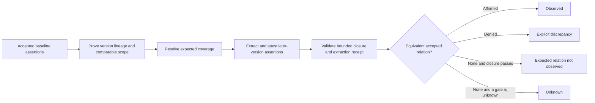

# Longitudinal Relationship Omission Design

- **Date:** 2026-07-25
- **Status:** Design accepted; omission detection disabled
- **Scope:** Generic document comparison with optional domain profiles
- **Principle:** Absence is unknown until a bounded observation is proven
  complete

## Outcome

Comparing document versions can reveal that a previously expected relation was
not observed in a later version. That result is not an explicit denial and is
not a negative tag. It is a neutral, evidence-backed comparison finding:
`expected_relation_not_observed`.

The generic design applies to any versioned document family. A regulatory
profile may later interpret a qualified finding as policy exclusion,
rescission, or another domain result. The generic layer never makes that
judgment.

## Keep four cases distinct

| Source situation | Representation |
| --- | --- |
| The source explicitly rejects a relation. | `RelationshipAssertion` with denied polarity |
| The source proposes or effects removal, suspension, adoption, or supersession. | `RelationChangeEvent` |
| A later, comparable, closed observation lacks an expected relation. | Neutral `expected_relation_not_observed` finding |
| The source is silent and closure or pairing is unproved. | `unknown` |

Neither a change event nor an omission rewrites the earlier assertion. Each
record remains attached to its artifact version, scope, time, evidence, and
lineage.

## Comparison flow

## Minimal new concept: closure claim

A `ClosureClaim` says that a named observation process completely enumerated a
bounded class of relations in a specific artifact region under a declared
profile. It is a reviewable claim, not a property of the document.

The claim binds:

- the artifact version and source region;
- the predicate family or collection shape covered;
- the applicability scope and temporal anchor;
- the extraction run, normalization policy, and profile version;
- the digest of accepted member assertions;
- evidence and quality-receipt identifiers;
- the claimant and attestation; and
- its effective or review time.

Closure is always local. A claim about one table, appendix, section, predicate
family, or extraction run cannot prove that the whole document or real world
is complete.

## Required gates

The comparator may emit `expected_relation_not_observed` only when every gate
passes:

1. The baseline assertion is accepted for the consumer and evaluation time.
2. A pairing or lineage proof shows that the artifacts are comparable
   versions or declared peers.
3. The expected relation belongs to the baseline coverage selected by the
   profile.
4. Scope and temporal comparison show that the expectation applies to the
   observed version.
5. The later artifact has a valid closure claim for the same predicate family,
   source region, scope, and profile version.
6. The extraction receipt proves that all declared regions were processed
   without silent truncation or unresolved failures.
7. No accepted equivalent affirmed or denied assertion exists in the closed
   observation.

A failed eligibility gate yields `not_comparable`. Missing evidence or
indeterminate scope, lineage, coverage, or closure yields `unknown`.

## Dependency-inverted services

The longitudinal comparator extends the existing comparison kernel through
three narrow protocols:

| Protocol | Responsibility |
| --- | --- |
| `VersionLineageResolver` | Prove the relationship between baseline and observed artifact versions. |
| `ExpectedCoverageResolver` | Select baseline relations the profile expects the later artifact to address. |
| `ClosureResolver` | Validate an evidence-bound closure claim for the exact observation boundary. |

Existing predicate, state, evidence, pairing, baseline, and scope resolvers
remain unchanged. A single adapter may implement more than one protocol, but
the comparator depends only on the protocols.

## Finding identity

The finding binds:

- expected assertion;
- baseline and observed artifact versions;
- comparison scope and evaluation time;
- profile and detector versions;
- pairing or lineage proof;
- expected-coverage proof;
- closure claim and extraction receipt; and
- all gate proof records.

Changing any of these inputs creates a new detector occurrence. A separate
correlation key may group repeated observations of the same conceptual gap.

## Domain interpretation

The generic finding means only:

> Under this declared comparison and closed observation, an expected relation
> was not observed.

A regulatory profile may derive `policyExclusion` only when separate authority,
applicability, deontic, and source-completeness rules pass. Scientific,
judicial, procurement, and contract profiles may use different labels or none
at all.

## 80/20 implementation path

1. Keep omission disabled in production.
2. Implement the three protocols with static adapters and synthetic failure
   tests.
3. Add one real document-family adapter whose structure supports bounded
   enumeration.
4. Measure closure precision and recall independently from relation extraction.
5. Enable only the neutral finding for that profile and boundary.
6. Add other document families one profile at a time.

The generic core need not prove closure for every document type before one
profile can use it. Each profile must fail closed outside its validated
boundary.

## Acceptance threshold

The first release may proceed when a frozen evaluation shows:

- zero omission findings outside proven lineage, scope, and closure;
- zero conversion of silence into explicit denial;
- complete proof records for every emitted finding;
- deterministic results from identical inputs; and
- separately reported closure, extraction, and comparison metrics.

Until then, the public result remains `unknown`.
