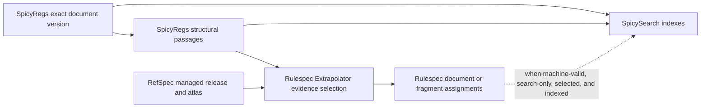
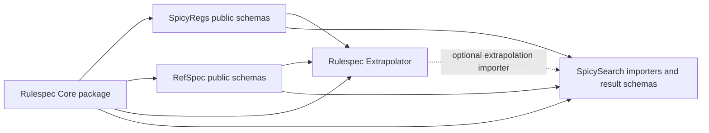
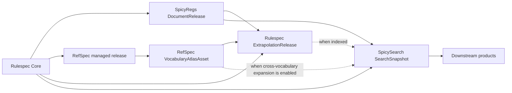

# SpicySearch Product Boundary and Extraction Plan

- **Date:** 2026-07-31
- **Status:** Core product boundary and static release flow implemented and
  verified locally; remaining compatibility cutovers and product milestones,
  commit, release, and promotion are separate delivery decisions
- **Scope:** SpicyRegs, RefSpec, Rulespec, and SpicySearch
- **Repository authority:** We own all four repositories. No current release,
  specification, interface, or repository boundary is canonical, and no
  external installed base constrains the redesign.
- **Migration baseline:** SpicyRegs `origin/main` at
  `be04ee5385d1dc813986a048f9dc7ebd75b800df`
- **Incubation snapshot at plan validation:** `feat/document-ai-pipeline` at
  `56e5ccf115726596667e9427b937381a5f8b37d1`, including uncommitted and nested
  RefSpec work
- **Change authority:** Implementation may reshape and propagate interfaces,
  schemas, tests, and documentation across all four repositories. Local work,
  commits, releases, and promotion remain separate delivery decisions.
- **Migration rule:** Archive, inventory, place, and verify the work before
  retiring it from SpicyRegs. Do not remove the post-baseline delta first.

**RefSpec implementation clarification (31 July 2026):** Current sections use
*managed release* for RefSpec's mature multi-file distribution and portable
Rulespec projection. `VocabularyRelease` appears only where dated history or a
superseded prototype requires its exact name. RefSpec generates
`VocabularyAtlasAsset` from verified managed releases; the duplicate compact
serializer, five-concept builder, and standalone validator are retired.
The execution record and remaining compatibility cutovers are tracked in the
[RefSpec reconciliation plan](../../../RefSpec/plans/2026-07-31-refspec-product-boundary-and-atlas-reconciliation-plan.md).

## Decision and supersession

The platform consists of four separate products. They integrate through
versioned releases, stable identifiers, and evidence references:

1. **SpicyRegs is the document-source product.**
2. **RefSpec is the ontology and vocabulary product.**
3. **Rulespec is the document-extrapolation product.**
4. **SpicySearch is the neutral document-search product.**

This plan supersedes, for current product ownership, the parts of
`2026-07-25-rulespec-spicy-regs-complete-vision-goal.md` that assign retrieval,
ranking, graph projections, vocabulary management, or extraction execution to
SpicyRegs. The older document remains design lineage, not the current ownership
map.

This plan also refines the 2026-07-27 SpicyRegs MVP decision recorded in
`docs/decisions.md`: retrieval remains outside the **SpicyRegs** MVP, and
SpicySearch receives its own MVP and automated release gates. The four-product
split must be reflected in the affected decision ledgers before code moves
between repositories.

The products remain separate even though the same organization owns them and
may change them together. Ownership determines where a correction is made and
which release publishes it; it does not require organizational isolation or
backward-compatibility work for interfaces that have never shipped.

## User outcome and product boundary

SpicySearch must provide this outcome:

> Given a question, structured filters, or seed documents, return the
> strongest document and passage candidates across public sources, explain
> every match, and disclose the limits of the search.

It stops before deciding what the documents mean for a person, organization,
or planned activity.

SpicySearch provides:

- exact documents, versions, and passages;
- cross-source links and related-document candidates;
- neutral, explainable retrieval ranking;
- evidence showing why each result appeared;
- searched-source coverage and known gaps; and
- machine-readable result sets.

Downstream products provide:

- workflow models;
- legal applicability decisions;
- organization-specific relevance and impact analysis;
- summaries and recommendations;
- completeness judgments; and
- proposals, visualizations, and optional wiki-style review or feedback
  workflows.

Document-only search is a fail-closed rule. Comments and comment-derived
signals never enter candidate generation or ranking. Dockets and proceedings
may organize, connect, or filter documents, but they are not returned as
documents. SpicyRegs may still preserve public comments as source records for
other products.

### MVP validation and feedback policy

No M1, M2, or M3 search-only result needs human approval. Stable mechanical
rules run as code. LLMs or independent subagents perform the baseline semantic
checks that would otherwise require manual inspection, and they persist their
inputs, outputs, evidence, disagreements, and abstentions. A notebook, short
script, or agent swarm is sufficient when it is clearer than a general-purpose
validation system. Promote a recurring finding into a deterministic fixture or
rule only when doing so makes the system simpler and more reliable.

People may later provide relevance and explanation feedback through the search
engine or a wiki-style document viewer. That feedback is product-utility data,
not document evidence, semantic approval, or live ranking authority. A later
versioned evaluation may use it to propose a new policy and snapshot.

## Product and authority map

Schema authority and data authority are separate. Each durable record has one
owner, even when another product generates a conforming projection of it.

| Product | Schema authority | Runtime and published data | Explicit exclusions |
| --- | --- | --- | --- |
| SpicyRegs | Source-native records, document identity and version records, passage coordinates, source observations, and acquisition coverage | Source connectors; immutable `DocumentRelease` records; exact text and passages; source history, failures, and exclusions | Vocabulary policy, derived semantic assertions, retrieval ranking, legal judgment |
| RefSpec | Managed vocabulary distributions and `VocabularyAtlasAsset`, capture, import, coverage, source-term resolution, crosswalk-candidate generation and validation, optional feedback, and source-specific vocabulary profile schemas | Vocabulary capture and import; managed publication of conforming concept, hierarchy, and mapping instances; resolution and validation records; vocabulary coverage; deterministic static crosswalk and lookup assets | Redefining portable SKOS or Rulespec shapes, document acquisition, a general evidence framework, extrapolation execution, live document queries, search ranking |
| Rulespec Core | Generic artifact, fragment, assertion, evidence, provenance, confidence, attestation, assignment, authority, lifecycle, `ReferenceResourceRelease`, and portable SKOS-composition structures | Generated schemas, validators, conformance fixtures, and the core release | Source connectors, source-specific storage, managed vocabulary content or selection, search serving |
| Rulespec Extrapolator | Extrapolation profiles, derived assertion types, and `ExtrapolationRelease` | The extraction and comparison runtime; evidence-bound assertions, assignments, relationships, and neutral findings | Canonical source text, vocabulary ownership, general document search, applicability decisions |
| SpicySearch | Search requests, runs, snapshots, results, explanations, ranking policy, search feedback, and search coverage | Document candidate generation from pinned releases and atlas assets, disposable indexes, ranking, query APIs, receipts, feedback events, and exports | Canonical documents, vocabulary mappings or atlas generation, extrapolation authority, legal or organizational judgments |

Every `DocumentRelease` includes a Rulespec Core `Artifact` projection for each
published document version and each published text representation, plus a
`SourceFragment` projection for each published structural passage. Each
fragment's `oa:hasSource` points to the exact representation artifact that its
selector addresses. SpicyRegs remains authoritative for the source record,
bytes, representations, passages, and coordinates; the Rulespec records
provide portable semantic identity. RefSpec may compose Rulespec Core evidence
and optional attestation structures without becoming a general
document-processing framework. No human approval is required for an M1, M2, or
M3 search-only candidate. Human review remains an optional later input, not an
MVP publication gate.

An external vocabulary publisher remains authoritative for its distribution
and native semantics. RefSpec owns the exact capture, import decision, managed
release, local resolution policy, evidence-backed cross-vocabulary mappings,
and deterministic `VocabularyAtlasAsset` generated from pinned releases. It
does not rewrite publisher history or present a local mapping as publisher
fact. Model- or agent-generated crosswalk candidates may receive `searchOnly`
eligibility when exactly two supporting machine validations resolve the pinned
evidence, pass deterministic checks, and use distinct validator actors,
independence groups, providers, provider model IDs, and response artifacts.
Human review is optional later feedback, not a publication prerequisite.

W3C SKOS remains authoritative for SKOS meaning. Rulespec Core defines the
portable composition and validation shapes used across these products;
RefSpec publishes the managed vocabulary instances and operational release
selection without redefining either authority.

Every RefSpec managed release exposes the exact complete Rulespec Core
`ReferenceResourceRelease` used by portable concept assignments, including its
identifier, digest, and concept membership. RefSpec owns the operational
managed-release manifest; Rulespec Core owns the portable release shape.

RefSpec may publish static, query-ready representations of its vocabulary and
crosswalk content. It does not acquire documents, answer live document queries,
rank search results, or become a second search framework. SpicySearch pins and
verifies the asset, then owns document-query planning and serving.

Rulespec currently describes itself mainly as a semantic substrate. Under this
plan, the repository contains two release units: the independent Rulespec Core
and the Rulespec Extrapolator. Rulespec owns and operates the extrapolation
runtime.

## Document processing sequence

The normative order is **source capture and structural segmentation, then
extrapolation and tagging, then search indexing**. Exact document and passage
search must work before tagging and must continue to work for untagged text.



### 1. Capture and version the document

SpicyRegs captures the source record and content, assigns the exact document
version, and records its source identifiers, retrieval facts, and content
digest. No downstream product may change that version record.

### 2. Publish structural source passages

SpicyRegs divides the exact version into stable, source-addressable passages
such as headings, paragraphs, table cells, or source-native sections. Each
passage binds to one exact text representation. Raw PDF, Office, image, and
other binary content is a `SourceRendition`, not searchable text:

```text
SourceRendition
  rendition_id
  document_version_ref
  source_native_path?
  source_url?
  media_type
  bytes_digest

SourceRenditionCapture
  capture_id
  source_rendition_ref
  observed_at
  retrieval_receipt_ref
  acquisition_release_ref
```

A rendition identifier is derived from the document version, native path or
URL, media type, and bytes digest. Its capture identifier is derived from the
rendition, observation time, receipt, and acquisition release. Re-fetching
identical bytes reuses the immutable rendition fact and appends a capture
event; it never mutates or discards prior capture evidence. `DocumentRelease`
pins the rendition fact, while acquisition coverage pins capture events. HTML
or JSON bytes may also be renditions; their decoded markup or source-native
string fields are separate text representations. Image or page regions may be
non-text evidence, but they are not searchable passages until a Unicode text
representation addresses them.

`TextRepresentation` is immutable addressable state, not a mutable parser
cache. Every instance contains exact addressable Unicode text and records:

```text
TextRepresentation
  representation_id
  document_version_ref
  representation_kind_and_path
  unicode_text_or_immutable_content_ref
  text_digest
  coordinate_system
  evidence_grade
  source_rendition_ref?
  decoding_or_extraction_method_version_and_config_digest?
  artifact_projection_ref
```

Its identifier is derived from the document-version identifier,
representation kind and native path, text digest, coordinate system, evidence
grade, source-rendition reference, and any decoding or extraction method,
version, and configuration digest. The rendition's bytes digest proves
lineage; it is not the text against which parser-derived or OCR-derived
coordinates revalidate. Parser- or OCR-derived text references its source
rendition and is labeled as derived evidence rather than source-exact text.

Each passage records:

- the exact document-version reference;
- the exact rendition or text-representation reference and digest;
- the passage-generation policy and version;
- its selector and coordinate system;
- start and end coordinates where applicable;
- the selected text digest; and
- enough coverage information to distinguish processed, excluded, and failed
  source regions.

The passage identifier is derived from the document version, representation,
segmentation-policy version, selector, and selected-text digest. A changed
boundary, coordinate system, representation, or policy cannot reuse the old
passage identifier.

This step describes source structure and addressability. It does not infer a
topic, workflow function, legal effect, or concept assignment. Source-assigned
API Topics and Lists of Subjects remain separate observations:

```text
SourceObservation
  observation_id
  document_version_ref
  source_record_version_ref
  source_native_path
  source_native_key_or_ordinal
  raw_value
  source_record_digest
  observation_kind

SourceObservationCapture
  capture_id
  source_observation_ref
  observed_at
  retrieval_receipt_ref
  acquisition_release_ref
```

The observation identifier is derived from the source-record version, native
path, key or ordinal, raw value, observation kind, and source-record digest.
The capture identifier is derived separately from the observation, time,
receipt, and acquisition release. Re-observing identical source state reuses
the immutable observation fact and appends a capture event; it never changes
the observation. `DocumentRelease` pins the exact observation fact set, while
acquisition coverage pins its capture events. An observation has no concept
identity. A metadata-only source change creates a new observation set and
`DocumentRelease` while retaining the same source-issued document version when
the source content version did not change.

Rulespec Core defines the portable `SourceFragment` shape. SpicyRegs projects
each published structural passage as a `SourceFragment` whose source is the
exact text-representation `Artifact`, but SpicyRegs remains authoritative for
the document bytes, source passage, and coordinate validation.

### 3. Extrapolate and tag documents or fragments

The Rulespec Extrapolator consumes a pinned `RulespecCoreRelease`,
`DocumentRelease`, `VocabularyAtlasAsset` triple, and exact
`ReferenceResourceRelease`. A `ConceptAssignment` targets the Rulespec
`Artifact` projection of a whole document version or an exact
`SourceFragment`. A fragment-level assignment does not imply the same
document-level assignment, and a document-level assignment does not
automatically propagate to every fragment.

When the extrapolator selects an evidence span narrower than a published
SpicyRegs passage, it may publish a derived `SourceFragment` in the
`ExtrapolationRelease`. That fragment must resolve against the pinned document
version, use the exact text-representation `Artifact` as its source, and carry
the representation and selected-text digests required for citable evidence.
Selecting a span does not create a new source passage or modify the
`DocumentRelease`.

The `ConceptAssignment` is an immutable Rulespec proposition. It uses
`assertsSubject` for the `Artifact` or `SourceFragment`, `assertsPredicate` for
the assignment role, `assertsObject` for the concept, `assertionPolarity` for
the affirmed proposition, and `assignedConceptRelease` for the exact complete
Rulespec `ReferenceResourceRelease`. The surrounding `ExtrapolationRelease`
separately pins the RefSpec atlas that proves the portable release's exact
membership.

Generation origin, evidence, confidence, optional attestation, consumer
eligibility, and lifecycle remain separate Rulespec records. Human approval is
not a current publication or search gate. For each assignment it evaluates, the
`ExtrapolationRelease` includes or references:

- the immutable `ConceptAssignment`;
- its separate `EvidenceBinding` records and `ExtractionActivity` lineage;
- fragment-backed evidence when the proposition depends on document text;
- `AILineage` and `usageEligibility=searchOnly` for an `aiSuggested`
  assignment;
- any optional `Attestation`, `LocalAdoption`, consumer-disposition, or
  `LifecycleEvent` records that exist;
- the applicable `BaselineValidationReceipt`; and
- an operational `ExtrapolationSelectionReceipt`.

`AgentValidationReceipt` is one immutable operational record per validator
attempt. `BaselineValidationReceipt` separately records the deterministic
reduction of those attempts. The product that owns the profile or semantic
release publishes both records; neither extends Rulespec Core or establishes
truth:

```text
AgentValidationReceipt
  receipt_id
  attempt_id
  owner
  target_ref_and_digest
  protocol_and_version
  input_manifest_ref_and_digest
  validator_actor_ref
  validator_kind: aiModel | aiAgent
  independence_group
  provider_model_id
  request_contract_ref_and_digest
  response_artifact_ref_and_digest?
  execution_status: completed | failed
  failure_reason?
  failure_artifact_ref_and_digest?
  check_outcomes[]
    check_id
    outcome: pass | fail | abstain | not_applicable
    rationale
    evidence_refs[]
  overall_recommendation?: supports | flags | abstains
  started_at
  completed_at
  advisory_attestation_ref?

BaselineValidationReceipt
  receipt_id
  owner
  target_profile_and_release_ref
  sample_manifest_ref_and_digest
  rubric_and_version
  aggregation_policy_and_version
  deterministic_check_receipt_refs[]
  deterministic_check_outcomes[]
  agent_validation_receipt_refs[]
  aggregate_result:
    usable_for_search | usable_with_nonblocking_limits | deferred | failed
  disagreements_and_flags[]
  known_limitations[]
  evaluated_at
```

Each attempt retains the secret-free request, sealed inputs, exact model or
agent identity, raw response, and per-check evidence. A retry creates a new
attempt and receipt instead of rewriting the first. A failed invocation or
invalid response is `execution_status=failed`, requires `failure_reason`, and
forbids `overall_recommendation`; a completed attempt requires the
response artifact and recommendation. Failure is not abstention. Replayability
means that another validator can inspect or rerun the same request; it does not
promise byte-identical output from a stochastic model. An optional Rulespec
`Attestation` is separate and advisory.

A usable baseline requires exactly two completed machine receipts. Both must
recommend `supports`; every check from both must pass; and their validator
actors, independence groups, provider/model identities, and response artifacts
must be distinct. A flag, failed check, abstention, failed execution, or extra
attempt makes that baseline non-usable. A later retry or reevaluation creates a
new sealed attempt set; it never restamps the original baseline.

The baseline receipt qualifies only the named profile and release for a
candidate-search deployment. It is not part of an assignment's evidence and
does not validate every assignment in the release. Each assignment still
requires its own exact evidence, lineage, deterministic selection checks, and
`verification=unverified` explanation.

Use deterministic code for schema conformance, identifier grammar, digest and
reference closure, release membership, coordinate validation, and exact-text
checks. Use independent LLMs or subagents for semantic judgments that a person
would otherwise inspect: whether the cited passage supports the proposed
assignment, whether a term has the claimed meaning and scope, whether an
ambiguity was ignored, and whether the output contains an obvious
hallucination. Validators work independently. A second validator checks the
same sealed sample without seeing the first response. A disagreement,
abstention, flag, or failed check defers the affected item or profile. A later
evaluation uses a new sealed input and a new independent pair; it does not form
a two-of-three vote or rewrite the original attempts. `usable_with_nonblocking_limits`
may disclose known limitations, but both qualifying receipts still recommend
`supports` and every one of their checks passes. Separate contexts on the same
foundation model are useful baseline critiques but count as one provider/model
identity for qualification. The aggregate policy may defer or fail the profile.
It never emits approval or `verification=verified`.

A notebook, short script, or agent swarm that writes these receipts is enough
for baseline validation. Add a deterministic semantic rule only when the rule
recurs, has an unambiguous expected result, and is easier to maintain than the
agent rubric.

```text
ExtrapolationSelectionReceipt
  receipt_id
  concept_assignment_ref
  selection_policy_and_version
  input_record_refs[]
  checks_and_outcomes[]
  selection_result
  evaluator_ref_and_version
  evaluated_at
  effective_as_of
  output_extrapolation_release_ref
  supersedes_receipt_ref?
```

`selection_result` is `selected`, `not_selected`, or `deferred`. This small
receipt is the release manifest's deterministic inclusion decision. It
records how the Extrapolator assembled a release. It does not approve, reject,
revoke, supersede, or authorize broader use of the assignment. The selection
policy may consume baseline validation and any canonical Rulespec social,
consumer, or lifecycle records that exist, but search-only selection does not
require a human `Attestation` or `LocalAdoption`. The receipt may be one row in
the release manifest; it does not require a reducer service or review workflow.

Later review, adoption, eligibility, or lifecycle changes may append optional
Rulespec records. Search feedback does not create any of them automatically. A
changed baseline or release selection creates a new receipt and
`ExtrapolationRelease`; neither operation mutates the assignment.

Aggregation never changes an existing assignment's scope. A versioned
aggregation policy may publish a new candidate document- or fragment-level
assignment with its own evidence, lineage, and selection receipt. It does not
inherit validation results, flags, or selection from its constituents and
cannot tag every fragment merely because a document-level assignment exists.

An untagged document or passage remains searchable. Missing tags never mean
that a concept is absent from the document.

### 4. Build disposable extraction and search views

A **processing segment** is a temporary model input assembled from source
structure for context-window, token, or batch limits. The Rulespec
Extrapolator owns its processing policy and run receipt. A processing segment
may combine, overlap, or truncate source passages. It is not citable evidence
and cannot be the target of an assignment served through the
`concept_assignment_candidate` channel.

A **search chunk** is a SpicySearch index unit created for lexical or semantic
retrieval. It may use different boundaries from both source passages and
processing segments. It is disposable, belongs only to a `SearchSnapshot`, and
must resolve every text-caused result to exact source passages or digest-valid
evidence fragments.

Every processing segment and search chunk publishes an ordered, reversible
text-projection map. The owning product may use its own manifest schema, but
the map contains:

```text
DerivedTextProjection
  derived_unit_id
  derived_text_digest
  derived_coordinate_system_and_interval
  input_passage_or_fragment_refs[]
  ordered_slices[]
    derived_start_and_end
    slice_kind: source_range | inserted_text | transformed_range
    source_text_representation_ref?
    source_coordinate_system?
    source_start_and_end?
    source_passage_or_fragment_refs[]?
    inserted_text_or_immutable_ref?
    inserted_text_digest?
    transform_method_version_and_config_digest?
    context_only
    overlap_or_truncation_flags[]
  omitted_source_ranges_and_reasons[]
  join_delimiter_and_normalization_policy
  construction_method_and_version
  tokenizer_or_model_version?
```

All intervals use their declared coordinate systems and half-open bounds. A
`source_range` requires source fields and forbids inserted or transform fields.
An `inserted_text` requires exact inserted content or an immutable reference
and digest and forbids source attribution. A `transformed_range` requires both
ranges and the deterministic transform. The map accounts for every derived
character and records every intentionally omitted input range. It therefore
represents insertion, deletion, normalization, overlap, truncation, and
reordering without pretending that derived text is source text.

A chunk-level semantic hit may cite all mapped source spans as candidate
support. It may say that one passage caused the match only when a deterministic
passage-level scorer proves that narrower attribution. A text result whose map
does not close against the exact source representations, transforms, inserted
text digests, and declared omissions fails closed.

SpicySearch separately records why a Rulespec assignment, RefSpec source-term
resolution, or concept mapping was or was not included in one snapshot:

```text
SearchImportReceipt
  receipt_id
  snapshot_id
  semantic_record_ref
  semantic_record_kind
  extrapolation_selection_receipt_ref?
  baseline_validation_receipt_ref
  import_policy_and_version
  rulespec_usage_and_lifecycle_refs[]?
  refspec_vocabulary_release_ref?
  refspec_resolution_policy_and_version?
  canonical_mapping_release_refs[]?
  refspec_vocabulary_atlas_asset_ref?
  refspec_vocabulary_atlas_manifest_digest?
  refspec_vocabulary_atlas_distribution_digest?
  optional_review_refs[]
  checks_and_outcomes[]
  import_result
  channel
  reason
  evaluated_at
  effective_as_of
```

`import_result` is `indexed`, `excluded`, or `deferred`. This is a consumer
indexing decision, not an approval record. SpicySearch may narrow upstream
eligibility but cannot broaden it or bypass access scope. It may be one row in
the snapshot import manifest; it does not require a separate service.

The evaluator fields are conditional on `semantic_record_kind`. A
`ConceptAssignment` requires exact evidence and lineage, an
`ExtrapolationSelectionReceipt`, and a usable baseline-validation receipt; an
`aiSuggested` assignment also requires `AILineage` and
`usageEligibility=searchOnly`. It forbids RefSpec source-resolution fields. A
`SourceTermResolution` requires the pinned RefSpec managed release,
resolution policy, evidence, and baseline-validation receipt and forbids the
Extrapolator receipt. A `ConceptMapping` requires its canonical endpoint
releases, evidence, and baseline-validation receipt. When that mapping comes
from a static atlas, the receipt also pins the RefSpec `VocabularyAtlasAsset`,
its manifest digest, and the exact distribution digest SpicySearch read.
Optional review records may be present, but none is required for search-only
use. No import policy can substitute one product's evidence or validation
mechanism for another's.

The release manifest distinguishes its selected subset from the retained
not-selected and deferred audit records, and extrapolation coverage counts all
three. Publication in the release alone never means approval or query
eligibility.

An assignment enters the `concept_assignment_candidate` channel only when its
Rulespec proposition conforms; its exact artifact or digest-valid fragment,
evidence, `ExtractionActivity`, `AILineage` when applicable, complete
`ReferenceResourceRelease`, and the RefSpec atlas that proves that release all
resolve; its baseline result is `usable_for_search` or
`usable_with_nonblocking_limits`; its Extrapolator receipt is `selected`;
upstream usage is capped at `searchOnly` and has no explicit blocking access or
lifecycle state;
and the snapshot's `SearchImportReceipt` is `indexed` for that channel. It is
still reported as `origin=model_derived`, `verification=unverified`, and
`disposition=search_candidate`. Validation and indexing never turn it into
source truth, an exact mapping, or a legal conclusion.

| Region or record | Publisher | Durable role | Permitted semantic use |
| --- | --- | --- | --- |
| Document version | SpicyRegs | Exact source state | Assignment target and search result |
| Structural source passage | SpicyRegs | Navigation, citation, and complete source coverage | Evidence reference or fragment projection; no derived tag stored on the source record |
| Derived `SourceFragment` | Rulespec Extrapolator | Exact evidence span within a pinned document version | Evidence and assignment target when digest-valid |
| Processing segment | Rulespec Extrapolator | Reproducible extraction input recorded in a run receipt | Candidate generation only |
| Search chunk | SpicySearch | Rebuildable lexical or semantic index unit | Candidate generation only |
| `ConceptAssignment` | Rulespec Extrapolator | Immutable evidence-bound semantic proposition | A conforming, evidence-bound `searchOnly` candidate may support explained retrieval after baseline validation, release selection, and search import |
| `BaselineValidationReceipt` | Profile or semantic-release owner | Reproducible deterministic and independent agent checks over a sealed sample | Qualifies a profile or release for candidate use; never proves semantic truth or applicability |
| `VocabularyAtlasAsset` | RefSpec | Immutable crosswalk candidates, qualification proof, and deterministic static lookup distribution over pinned vocabulary releases | May support `searchOnly` query expansion; never becomes publisher truth or a mutable search index |
| `ExtrapolationSelectionReceipt` | Rulespec Extrapolator | Immutable deterministic record of release assembly | Never substitutes for approval, verification, or lifecycle state |
| `SearchImportReceipt` | SpicySearch | Immutable consumer-side index selection for one snapshot | May narrow but never broaden upstream eligibility |

### Independent change and release rules

- Changed source content creates a new document version and
  `DocumentRelease`.
- Changed passage boundaries or segmentation policy creates a new
  `DocumentRelease` without pretending that unchanged source bytes are a new
  source-issued version.
- Changed parser or OCR text, method, version, or configuration creates a new
  text representation, passage identifiers, and `DocumentRelease`, while the
  source-issued document version may remain unchanged.
- A metadata-only source change creates a new source-observation fact set and
  `DocumentRelease`. It does not create a new source-issued document version
  unless the publisher's versioned content changed.
- Changed vocabulary capture, membership, publisher or managed-release mapping,
  or resolution creates a new RefSpec managed release.
- Changed atlas-candidate input, model lineage, validation receipt, selection
  policy, generator implementation, static distribution, or later human
  feedback creates a new RefSpec `VocabularyAtlasAsset`. It never rewrites an
  earlier asset or its `searchOnly` disposition.
- Changed extraction configuration, model, or evidence selection creates a new
  `ExtrapolationRelease`; it does not rewrite a `DocumentRelease`.
- Human or agent attestation, local adoption, and assignment lifecycle records
  are optional future inputs. If used, they append canonical Rulespec records.
  Search feedback never creates them automatically. A changed baseline,
  validation rubric, model, or release selection creates a new
  `BaselineValidationReceipt`, `ExtrapolationRelease`, and selection receipt as
  applicable; none mutates the assignment.
- Changed chunking, embedding, ranking, or indexing creates a new
  `SearchSnapshot`. A changed import policy or effective upstream state also
  creates a new snapshot and `SearchImportReceipt`; neither rewrites upstream
  releases.
- A new document or observation release requires a new dependent
  `SearchSnapshot` before the changed state can be queried.
- Old assignments and search snapshots remain bound to the exact releases
  against which they were produced.
- A new document, representation, vocabulary, or policy release never carries
  an old assignment forward implicitly. Reuse requires a new extrapolation
  selection receipt and a new search import receipt with explicit lineage.

## Dependency graphs

Product ownership alone is not a sufficient dependency rule. Build-time
schema dependencies and runtime data dependencies stay explicit and point in
one direction.

### Schema and build dependencies



The Rulespec Core release must build and test without RefSpec, SpicyRegs, or
SpicySearch. The Rulespec Extrapolation release may pin the Core release plus
specific SpicyRegs and RefSpec releases. Keeping the two Rulespec release units
separate prevents a Rulespec-Core-to-RefSpec-to-Rulespec cycle.

### Published-data dependencies



The complete release order is Rulespec Core first; SpicyRegs and RefSpec in
either order; Rulespec Extrapolation after both when used; and SpicySearch
after every input it pins. This is the required release-artifact directed
acyclic graph.

Every consumer reads a published release or a pinned local release fixture. No
repository imports another repository's source tree or reads its mutable
database. A manifest or schema-digest mismatch fails closed.

## Published integration records

| Publisher | Published output | Required pins | Primary consumers |
| --- | --- | --- | --- |
| Rulespec Core | `RulespecCoreRelease`, schemas, generated types, validators, conformance fixtures | None | SpicyRegs, RefSpec, Rulespec Extrapolator, SpicySearch |
| SpicyRegs | `DocumentRelease`, document versions, source renditions and text representations with Rulespec `Artifact` projections, passages with `SourceFragment` projections, source observations, rendition and observation capture events, source links, `LinkVerificationReceipt` records, acquisition coverage | Rulespec Core | Rulespec Extrapolator, SpicySearch |
| RefSpec | Managed release distribution, Rulespec `ReferenceResourceRelease` projection, concepts, labels, hierarchy, mappings, redirects, `SourceTermResolution` records and evidence, baseline-validation receipts, resolution policy, vocabulary coverage, and deterministic `VocabularyAtlasAsset` crosswalk and lookup files | Rulespec Core; each atlas asset also pins every input managed release, closed crosswalk bundle, policy, implementation, runtime, and output digest | Rulespec Extrapolator, SpicySearch |
| Rulespec Extrapolator | `ExtrapolationRelease`, evidence-bound assertions, assignments, agent- and baseline-validation receipts, `ExtrapolationSelectionReceipt` records, relationships, comparisons, extrapolation coverage | Rulespec Core, one SpicyRegs `DocumentRelease`, one RefSpec atlas triple, and one exact atlas-proven `ReferenceResourceRelease` | SpicySearch and downstream products |
| SpicySearch | published `SearchSnapshot`, build receipt, index-coverage manifest, `SearchImportReceipt`, terminal `SearchRun` receipts, `SearchResultSet`, explanations, query coverage, feedback events, export manifest | Every indexed upstream release and policy version | Downstream products |

Every published record carries a stable identifier and release identifier.
Every evidence-bearing record also carries a content digest or an exact
reference to content in a pinned release.

A `SearchSnapshot` pins:

- one or more SpicyRegs document releases;
- each retained RefSpec vocabulary-atlas asset, including its asset ID,
  manifest digest, and selected static-distribution digest; the atlas manifest
  carries its exact managed-release inputs;
- any Rulespec extrapolation release used for structured relationships;
- each baseline-validation receipt used to qualify a candidate profile or
  semantic release;
- each `SearchImportReceipt` used to include, exclude, or defer a semantic
  record;
- the Rulespec Core schema release;
- snapshot-build policy version;
- query-planner and ranking-policy versions;
- source and document-type eligibility policy versions;
- included lexical, vector, or graph index manifests, if any;
- references to upstream coverage manifests; and
- its own immutable index-coverage manifest and successful publication
  receipt.

A versioned snapshot-build policy classifies inputs and indexes as required or
optional and defines which build-time freshness failures block publication.
Mutable build control state emits append-only status events. Terminalization
publishes one immutable receipt with `terminal_status=published|failed`. Only
a snapshot named by a `published` terminal receipt is queryable. A failed
build remains inspectable with its checks and failures but cannot serve the
indexes that happened to finish. Optional failures may appear only in a
published snapshot whose policy permits them and whose coverage discloses the
gap.

Corrections occur in the product that owns the record. SpicySearch consumes a
new release and rebuilds its read models. A cache, graph edge, embedding, or
search result or feedback event never promotes a candidate into source data, a
vocabulary mapping, a verified assignment, or a legal conclusion.

## Query catalog

The first-class API must cover these document-level jobs without requiring
consumers to reconstruct joins or submit SQL:

| Search job | Required behavior |
| --- | --- |
| Find a known document | Resolve an official identifier, URL, docket ID, RIN, bill number, opinion, report, form, or citation to exact document versions. |
| Search by subject | Expand evidence-bound, baseline-qualified terminology as explained search candidates while retaining source terminology as separate source metadata. |
| Find supporting passages | Return exact passages that caused a text-based match. |
| Follow references | Return documents cited, incorporated, or directly linked by the seed document. |
| Find backlinks | Return later documents that cite, amend, implement, challenge, or replace the seed when evidence supports that relation. |
| Find the same matter | Use proceedings, dockets, RINs, and verified cross-posts to find earlier and later documents. |
| Find unlinked related documents | Generate candidates through shared authority, program, population, procedure, standard, concept, or text. |
| Find possible governing context | Return overlap candidates without claiming that they govern or apply. |
| Search by workflow function | Find passages about inputs, roles, criteria, exceptions, escalation, approval, outputs, or recordkeeping. |
| Find versions and changes | Return current, replaced, and point-in-time versions plus changed or upcoming dates. |
| Inspect coverage | Report what was searched and what was unavailable, restricted, stale, excluded, unsupported, or unprocessed. |
| Export a source set | Return documents, passages, identifiers, versions, evidence, and explanations for another tool. |

Every search operation supports, where its pinned sources do, filters for
agency, jurisdiction, source, document type, program, geography, publication
date, effective date, status, proceeding, and concept. An unsupported filter
or historical request returns a typed limitation or error; it is never ignored.

`as_of` asks what the pinned source history establishes was source-available
at that instant. It is distinct from publication-date and effective-date
filters and from the later time at which SpicySearch captured or indexed a
record. The snapshot fixes what evidence the system can know; each result
discloses source-availability and system-observation times. If a source lacks
enough history to answer `as_of`, request validation fails for a required
source or the source is an explicit gap only when partial policy permits and
the remaining filters keep their meaning.

Initial public operations are:

1. `search_documents`
2. `get_document`
3. `get_document_connections`
4. `export_search_run`

Implement `search_documents` first. Keep raw SQL as a diagnostic interface,
not the product API.

## Search records

SpicySearch exposes a storage-independent record model:

```text
SearchRequest
  question
  identifiers[]
  seed_documents[]
  search_intents[]
  filters
  as_of
  requested_sources[]
  snapshot_id?
  failure_policy
  limit
  cursor

SearchSnapshotBuildAttempt
  attempt_id
  candidate_manifest_digest
  build_policy_and_version
  retry_of_attempt_id?
  status_events[]

SearchSnapshotBuildReceipt
  attempt_id
  terminal_status
  snapshot_id?
  input_release_and_policy_refs[]
  build_checks[]
  failures[]
  started_at
  completed_at
  index_coverage_ref?

SearchRunAttempt
  attempt_id
  run_id
  request
  request_digest
  snapshot_id
  retry_of_run_id?
  started_at
  status_events[]

SearchRun
  run_id
  attempt_id
  request_digest
  snapshot_id
  snapshot_selection_method_and_policy
  terminal_status
  retry_of_run_id?
  started_at
  completed_at
  executed_channels[]
  unsupported_filters[]
  source_outcomes[]
  failures[]
  coverage_refs[]
  planner_version
  ranking_policy_version

SearchResultSet
  search_run_id
  ranked_documents[]
  next_cursor
  export_metadata

DocumentResult
  document_version_ref
  official_metadata
  passage_evidence[]
  match_explanations[]
  rank_key

PassageRef
  passage_id
  document_version_ref
  text_representation_ref
  representation_text_digest
  selector
  coordinate_system
  selected_text_digest
  evidence_grade
  extraction_method_and_version?

PassageEvidence
  passage_ref
  match_selector?
  matched_text_digest?

MatchExplanation
  explanation_id
  reason
  origin
  verification
  disposition
  evidence_refs[]
  passage_evidence[]
  method_and_version
  channel_score?

RankKey
  evidence_tier
  controlling_explanation_ref
  method_precedence
  normalized_channel_score
  stable_document_version_id

SearchCursor
  request_digest
  snapshot_id
  ranking_policy_version
  last_rank_key

SearchFeedbackEvent
  feedback_id
  search_run_id
  snapshot_id
  result_set_digest
  surface: search | wiki_viewer | api
  target_document_passage_or_explanation_ref?
  signal_kind: explicit | behavioral
  feedback_kind:
    relevant | not_relevant | missing_result | explanation_issue | other
  value_or_rationale?
  actor_or_pseudonymous_session_ref?
  interface_version
  recorded_at
  access_scope_ref?
  retention_policy_ref?
  supersedes_feedback_ref?

origin
  source_stated
  deterministic
  model_derived

verification
  verified
  unverified
  not_applicable

disposition
  durable
  search_candidate
```

`failure_policy` defaults to `allow_partial`; the other value is
`require_all_requested_sources`. Unsupported filters, unsupported `as_of`
semantics, invalid cursors, and other request-validation failures always fail
with no result set regardless of this policy. Partial success applies only to
source or retrieval-channel gaps that do not alter the meaning of the filters
that were applied.

Build attempts and run attempts are mutable control state with append-only
status events. Each terminal attempt publishes one immutable receipt.
`SearchSnapshotBuildReceipt.terminal_status` is `published` or `failed`;
`published` requires the final snapshot identifier and coverage reference,
while `failed` cannot name a queryable snapshot.
`SearchRun.terminal_status` is `succeeded`, `succeeded_with_gaps`, `failed`, or
`cancelled`; `running` exists only on the attempt. A successful run has a
complete response page and complete execution and coverage records for every
required channel; `next_cursor` may still identify later ranked results. A run
with `allow_partial` may return a result set as `succeeded_with_gaps` when at
least one eligible channel completed and each gap is disclosed. A
required-source failure, planner failure, or absence of any completed eligible
channel produces `failed` and no result set. A cancelled run has no final
result set. Retrying creates a new attempt and run identifier with
`retry_of_run_id`;
it never resumes or mutates the earlier terminal receipt. Published snapshots
and result sets reference only immutable terminal receipts.

The three explanation axes are independent. A source-stated cross-post can
also be mechanically verified. A Federal Register API Topic is source-stated
evidence, yet any document-to-document relatedness it supports remains a
search candidate. Baseline validation never earns `verification=verified`; only
a separately defined deterministic verification method may change that axis,
without changing how the result originated.

`reason` uses specific values such as `exact_identifier`, `direct_link`,
`citation`, `backlink`, `shared_proceeding`, `shared_authority`,
`shared_source_topic`, `concept_assignment`, `workflow_element`,
`lexical_similarity`, or `semantic_similarity`. `evidence_refs` resolve inside
the pinned snapshot.

`SearchFeedbackEvent` records only that a person or interface supplied a
utility signal through search or a later wiki-style viewer. It is not document
evidence, mapping evidence, concept-assignment evidence, a match explanation,
or a ranking tier. A click, vote, or comment never changes the completed run or
its snapshot. Later use requires a versioned evaluation-dataset manifest that
selects events, documents privacy, deduplication, and bias handling, and freezes
train, development, and holdout splits. Any resulting ranking change requires
a new evaluated ranking policy and `SearchSnapshot`; no ranking feature reads
raw feedback directly. An explicit future semantic review action may create a
separate record in its owning product, but feedback never becomes that record
automatically. A downstream viewer submits the event through a SpicySearch API;
its own release never becomes an upstream build dependency. Product feedback
also remains distinct from public-source comments, which stay outside document
retrieval and ranking.

Every result identifies an exact version tuple:

```text
(publisher, source_record_id, document_release_id, version_id, content_digest)
```

Passages are conditional evidence, not mandatory decoration. When text caused
a match, the result must include each exact `PassageRef` and, when the match is
narrower, a `PassageEvidence.match_selector` and matched-text digest. When an
identifier, metadata assertion, or direct link caused the match, the
explanation cites that exact source assertion and may use
`passage_evidence=[]`.
SpicySearch must not fabricate passage evidence.

A Rulespec `SourceFragment` may appear as a portable reference only when its
selector and digests resolve against an exact text representation in a pinned
`DocumentRelease`. It may correspond to a published SpicyRegs passage or to a
narrower derived evidence span. Processing segments and surrounding context
may help candidate generation, but the API must not present them as citable
passages unless each returned span independently meets this rule.

Every returned passage discloses whether its text is source-exact,
parser-derived, or OCR-derived and names the method that produced derived text.
The API never presents coordinates without the representation and coordinate
system they address.

For the first-slice cross-post, `verification=verified` requires a deterministic
`LinkVerificationReceipt` published by SpicyRegs with the `DocumentRelease`.
Every receipt records its identifier, comparison method and version, checks,
outcome, and typed failure reason when applicable. A successful receipt also
records both source-record references and digests, the source field and raw
value. A failed receipt records every available input; an unavailable record
or digest may be absent only when that absence is the typed cause of failure.
The method verifies that:

1. both source records and their digests resolve in the same pinned
   `DocumentRelease`;
2. the Regulations.gov `documents.fr_doc_num` value passes the Federal
   Register document-number grammar; and
3. that raw value equals the Federal Register source record's
   `document_number` exactly.

This preserves `origin=source_stated` for the Regulations.gov field while
recording deterministic verification separately. A missing record, digest
failure, malformed value, or mismatch cannot earn `verified`; the source
statement may remain an explained search candidate when policy permits.

## Coverage model

Coverage has five owners:

1. **SpicyRegs acquisition coverage:** requested sources, captured records,
   failures, restrictions, staleness, and exclusions.
2. **RefSpec vocabulary coverage:** available schemes, release features,
   unresolved source terms, mapping-validation coverage, and optional review
   coverage.
3. **Rulespec extrapolation coverage:** eligible records, processed records,
   selected, deferred, and excluded candidates, validator abstentions and
   disagreements, failures, and profile scope.
4. **SpicySearch snapshot and index coverage:** per source, document,
   representation, passage, channel, and index state; counts and digests;
   chunk, lexical, embedding, and graph manifests; and the states `eligible`,
   `indexed`, `excluded`, `failed`, `stale`, `unsupported`, and `not_used`.
5. **SpicySearch query coverage:** requested and executed channels, filters,
   per-source outcomes, unsupported capabilities, and timeouts for one run.

```text
SearchSnapshotCoverage
  coverage_id
  snapshot_id
  upstream_coverage_refs[]
  source_and_document_states[]
  representation_and_passage_states[]
  channel_and_index_states[]
  eligible_indexed_excluded_failed_counts
  input_and_output_digests[]
  chunk_lexical_embedding_graph_manifest_refs[]
  failures_and_reasons[]
```

Each `SearchSnapshot` pins one immutable `SearchSnapshotCoverage` manifest and
its digest. `SearchRun` references that manifest separately from live query
outcomes, references upstream coverage only for releases and channels that the
snapshot and request actually use, and then publishes query coverage. An
unused layer appears as `not_used` rather than implying that the product
processed the request. SpicySearch does not copy or reinterpret upstream
coverage. Snapshot and query coverage are returned even when no documents
match, so `no match` is distinguishable from `never indexed` and `query
failed`.

Coverage freshness is evaluated and frozen at build time under the pinned
build policy. Required failed or stale inputs block publication; optional ones
may be excluded and disclosed when policy permits. Elapsed time never mutates
an immutable snapshot into a different state. A separate mutable `current`
pointer and versioned current-selection policy may stop choosing an older
snapshot, while an explicitly addressed published snapshot remains replayable.

## Retrieval order and ranking

SpicySearch executes four evidence channels in order:

1. Official identifiers and direct links.
2. Citations, backlinks, proceedings, authorities, agencies, programs,
   standards, dates, and source-assigned metadata.
3. Baseline-qualified RefSpec term resolutions, atlas-qualified `searchOnly`
   crosswalk expansion, machine-valid `searchOnly` Rulespec assignment
   candidates, and named workflow candidates.
4. Lexical and semantic similarity.

Federal Register API Topics belong to channel 2 as source-assigned metadata,
not to a concept-assignment or resolved-term channel.

The controlling explanation for a document is selected deterministically from
its strongest available evidence tier. Within that tier, the pinned ranking
policy chooses the lowest method-precedence value, then the highest normalized
score, then the stable explanation identifier. Unlike method scores are not
compared unless that policy defines and versions their normalization.

Scoreless binary methods, including exact identifiers and verified links, use
the policy constant `1.000000` in the rank key while retaining
`channel_score=null` in the explanation. Probabilistic scores are converted to
a fixed six-decimal value by the pinned method-specific normalization rule.

The total document ranking key is lexicographic:

```text
best_evidence_tier ascending,
controlling_method_precedence ascending,
controlling_normalized_channel_score descending,
stable_document_version_id ascending
```

Evidence tiers are:

1. exact seeded official identifier;
2. explicit, verified link or citation;
3. source-stated metadata or structured source relation;
4. baseline-qualified concept, term-resolution, or workflow candidate; and
5. lexical or semantic candidate.

The first available tier wins. Lower-strength scores cannot displace an exact
or verified match. `rank_key.controlling_explanation_ref` names the explanation
that supplied the method and score. SpicySearch retains every contributing
channel, score, method, and explanation even when only the controlling
explanation determines ordering. It never flattens unlike signals into one
unexplained score.

A search cursor binds the normalized request digest, snapshot identifier,
ranking-policy version, and complete last rank key. The request digest excludes
the cursor and page-size fields. A cursor with any mismatched binding fails
closed.

## Vocabulary invariants

### Federal Register Thesaurus

The April 1, 2025 Federal Register Thesaurus is the default candidate
vocabulary for Federal Register documents. It receives strong source-specific
priority without becoming the root ontology for RefSpec or for other source
vocabularies.

The 1995 Federal Register vocabulary is dropped from the active plan. Do not
package it, index it, maintain a 1995-to-2025 crosswalk, or make it a release or
regression dependency. The migration inventory must mark any existing 1995
implementation artifacts for removal once their consumers are proven absent.
Repository history may preserve the fact that the experiment existed.

Historical broad categories, if encountered in captured source material, are
historical document groupings or optional local routing signals. They are
never asserted as `skos:broader` hierarchy.

### Federal Register API Topics

Current Federal Register API Topics always remain mutable source-assigned
observations. An evidence-backed, baseline-qualified RefSpec resolution may
support separately explained candidate expansion from an observation, but it
never converts the observation into a concept or a Rulespec concept
assignment. Raw label or embedding similarity alone cannot enter either the
resolved-term or concept-assignment candidate channel.

### Source-term identity and resolution

RefSpec resolves a source term through an exact `SourceTermKey`, not by turning
each document observation into vocabulary data:

```text
SourceTermKey
  source_system_and_profile_version
  observation_kind
  source_native_path
  raw_value_and_language
  source_context_discriminator?

SourceTermResolution
  resolution_id
  source_term_key
  resolution_status
  policy_and_version
  reason
  target_concept_and_release?
  evidence_refs[]
  baseline_validation_receipt_ref
  optional_review_refs[]
```

Each SpicyRegs observation joins to exactly one resolution by the complete
key. The same raw label in a different source field, profile, language, or
declared context is a different key. This keeps the managed release
independent of any one `DocumentRelease` while making every query-time
resolution explicit and reproducible.

### Lists of Subjects

Every Lists of Subjects observation must have exactly one explicit resolution
record with a policy version and reason:

| Resolution | Target cardinality | Meaning |
| --- | --- | --- |
| `officialTerm` | Exactly one concept in the pinned 2025 Federal Register Thesaurus release | The source label is the official term. |
| `recognizedVariant` | Exactly one concept in that release | Evidence supports the label as a variant of the official term. |
| `sourceLocalOpenTerm` | No concept target | Preserve the source's open term without minting a concept. |
| `unresolved` | No concept target | Evidence is insufficient; resolution remains open. |

Only `officialTerm` and `recognizedVariant` may support a
`resolved_term_candidate` expansion. The resolution, evidence, target concept
and complete reference release, baseline-validation receipt, and a
snapshot-local `SearchImportReceipt` with `import_result=indexed` for that
channel must all resolve. Human review is optional. `sourceLocalOpenTerm` and
`unresolved` always fail that predicate. The originating SpicyRegs observation
remains source metadata regardless of the resolution.

A missing resolution fails closed. Label equality, normalization, an
embedding score, or a graph neighborhood never silently mints a concept or an
`skos:exactMatch`. Embeddings may propose mappings for validation or optional
review; RefSpec owns their evidence and disposition.

Before a concept-assignment or resolved-term candidate channel is enabled, the
conformance corpus must contain positive fixtures for all four resolution
states, including `recognizedVariant` and `unresolved`.

## Initial SpicySearch snapshot

The first snapshot uses immutable Parquet files and DuckDB. It contains:

- document records that pass the document-only allowlist;
- exact document versions, text, and passages;
- official identifiers and direct source links;
- source-assigned observations, kept distinct from concepts;
- citations, proceedings, authorities, agencies, programs, standards, and
  dates when available; and
- per-source coverage, failures, exclusions, restrictions, and staleness.

The first snapshot does **not** require lexical, vector, semantic, or graph
indexes. Add each only after the deterministic slice passes.

RefSpec generates the canonical static vocabulary-atlas asset and any
query-ready vocabulary projection. SpicySearch may read a pinned distribution
behind its own adapter; it does not generate or govern that crosswalk.
LadybugDB remains an optional SpicySearch read-model runtime. Adopt it only if
a real `get_document_connections` query materially improves over DuckDB in
latency, clarity, or maintenance cost. Any document graph is rebuildable from
pinned releases and is not another source of truth.

## First vertical slice

Before moving production code, seal one executable fixture for this query:

> Starting from Federal Register document `2026-03227`, return the exact
> document, its verified Regulations.gov cross-post, and related
> meat-inspection documents. Explain every connection and report coverage.

Seal a second request against the same snapshot before any extrapolation:

> Find the exact phrase `Poultry Inspection System` in Federal Register
> document `2026-03227` and return every source passage that contains it.

This request may use a deterministic direct scan; it does not require a
lexical index. The sealed request uses a case-sensitive substring over the
stored text selected by each published structural passage, with no stemming,
synonym expansion, or hidden normalization. It must return the exact
text-representation and passage
identifiers, coordinate systems, selectors, representation and selected-text
digests, evidence grades, and the narrower phrase selectors. The fixture
records the complete ordered match set and proves that untagged passages are
searchable and that missing assignments neither exclude a passage nor assert
that a concept is absent.

The fixture records:

- the exact ordered document-version identifiers;
- expected explanation reasons, origins, verification states, and
  dispositions;
- the cross-post `LinkVerificationReceipt` and each verification check;
- evidence identifiers and expected passage coordinates where text caused a
  match;
- the exact-phrase result and proof that its passage has no required
  `ConceptAssignment` dependency;
- a Regulations.gov record with a mismatched `fr_doc_num` that cannot earn
  `verification=verified`;
- excluded dockets, comments, and comment-derived inputs;
- all pinned release and policy identifiers; and
- expected acquisition, vocabulary, and query coverage, with extrapolation
  reported as `not_used`.

At minimum, the slice must:

- rank Federal Register document `2026-03227` first by exact identifier;
- return its Regulations.gov cross-post through source link evidence and a
  passing `LinkVerificationReceipt`;
- return Federal Register document `2026-03228` only as a candidate when the
  shared source API Topic is the available connection;
- use `passage_evidence=[]` for metadata-only matches;
- exclude dockets and comments from returned documents;
- avoid minting identity, concepts, assignments, or exact mappings from shared
  labels; and
- report unavailable and unprocessed sources; and
- return the exact phrase from a digest-valid structural passage without an
  `ExtrapolationRelease`.

The historical
`docs/evidence/single-document-rulespec-projection-2026-07-28` fixture may
supply its exact passages, digests, and source-link input. The new receipt must
verify that link. Do not reuse the historical API-Topic-derived
`ConceptAssignment` records; they violate the current source observation
invariant.

## Repository migration

The migration baseline locates recent incubation work; it does not define
product ownership. Search code also predates `origin/main`, including the CLI
search, client-side search-index builder, embedding pipeline, scheduled docket
search, notebooks, and MCP access. The inventory must cover those surfaces as
well as `origin/main..HEAD` and uncommitted work.

### Migration manifest

Create one manifest that records, for every migrated or retired item:

- originating commit and path;
- uncommitted or nested-repository state, when applicable;
- capability and current behavior;
- scheduled jobs, command-line entry points, notebooks, and published artifact
  locations;
- known consumers;
- owning product and destination;
- disposition: move, reimplement, retain, historical evidence, or retire;
- replacement interface and pinned fixture;
- tests or evidence that prove parity or intentional retirement; and
- migration status.

Mixed commits are normal in the current branch. Preserve the complete
incubation lineage in an archival ref or repository copy; do not promise a
clean per-product Git history that the source commits do not contain.

### Durable destinations

| Incubated capability | Final owner and disposition |
| --- | --- |
| Source connectors, immutable source records, exact versions and passages, source observations, acquisition coverage | Keep or reimplement in SpicyRegs. |
| Vocabulary source capture, current managed releases, concepts, hierarchy, mappings, redirects, mapping-candidate generation and validation, optional feedback, source-term resolution, and deterministic static atlas lookup assets | Move or reimplement in RefSpec. |
| Generic semantic and evidence structures, validators, profiles, extrapolation runtime, candidate derived assertions and comparisons | Move or reimplement in the appropriate Rulespec release unit. |
| Query planning, filters, ranking, results, explanations, search receipts, lexical/vector indexes, graph queries, query-time coverage | Move or reimplement in SpicySearch. |
| Vocabulary-atlas crosswalk and static lookup projection | Reimplement as a RefSpec `VocabularyAtlasAsset`; preserve the mixed v5 graph and embedding experiment in RefSpec research. Document filtering, related-document queries, and ranking remain SpicySearch responsibilities. |
| Mixed generated evidence | Preserve with the decision it supports; never treat it as runtime authority. |

The current `docpipeline`, `ontology`, and `enrichment` packages import one
another directly. Define and test release records before moving directories. A
mechanical directory move would preserve the ownership error.

## Milestones and gate application

The plan has three separately gated milestones. Passing an earlier
milestone does not imply that a later channel exists.

1. **M1 — deterministic document and passage search.** Split repository
   ownership, publish exact document versions, source renditions, text
   representations, structural passages, source observations, capture events,
   and verified links, then replay
   both first-slice requests from one published `SearchSnapshot`. Apply the
   Product split, Structural passage publication, Snapshot and run lifecycle,
   First search slice, and base Vocabulary safety gates. Rulespec extrapolation
   is `not_used`.
2. **M2 — search-only candidate extrapolation.** Publish a nonempty
   `ExtrapolationRelease` with document- and fragment-level assignments,
   exact evidence and lineage, baseline-validation and selection receipts, and
   extrapolation coverage. Apply the M2 Extrapolation and derived-view and
   candidate-expansion Vocabulary safety gates before enabling the
   `concept_assignment_candidate` channel. Human Attestation, LocalAdoption,
   and lifecycle fixtures are not required. An empty release cannot satisfy
   M2.
3. **M3 — lexical and semantic expansion.** Add lexical retrieval first. Any
   chunk-backed text channel must pass reversible-projection gates before it
   serves results. Add semantic retrieval only after the separate sealed
   holdout passes the Semantic-search adoption gate. M3 is an adoption step,
   not a prerequisite for M1 or M2.

M1 completes the first useful product split. M2 completes migration of the
current extrapolation capability. M3 completes the planned lexical channel;
its semantic sub-step remains optional when the holdout does not show enough
value to justify its cost or risk.

| Automated release-gate subsection | M1 | M2 | M3 |
| --- | --- | --- | --- |
| Product split | Required | Must remain passing | Must remain passing |
| Structural passage publication | Required | Must remain passing | Must remain passing |
| Snapshot and run lifecycle | Required | Must remain passing | Must remain passing |
| First search slice | Required | Replay unchanged | Replay unchanged |
| Vocabulary safety | Base ownership, 2025 default, no-1995, observation, and explicit-resolution invariants | Candidate-expansion and positive resolution fixtures also required | Must remain passing |
| Extrapolation and derived views | `not_used` | Assignment, processing-segment, and selection/import gates required | Search-chunk projection gates also required |
| M2 concept-assignment candidate slice | Not used | Required | Replay unchanged |
| M3 lexical slice | Not used | Not used | Required |
| Semantic-search adoption | Not used | Not used | Required only before enabling semantic retrieval |

The sealed M2 request uses an exact RefSpec concept identifier and only the
`concept_assignment_candidate` channel. Its fixture includes separately scoped
document- and fragment-level assignments plus controls for missing or invalid
evidence, digest mismatch, wrong vocabulary release, missing `AILineage`,
non-`searchOnly` usage, processing-segment targets, validator abstention, and
search-import exclusion. It returns only candidates that pass the pinned
baseline, deterministic selection, and import policies. The snapshot remains
byte-for-byte replayable after later receipts or feedback events are appended.

The sealed M3 lexical request uses `worker safety attestations` over the fixture
corpus. It must prove tokenization and ranking, pagination, exact mapped source
passages, snapshot and query coverage, and the reversible projection of at
least one combined search chunk. Inserted delimiter, deleted range,
many-to-one Unicode normalization, and malformed-coordinate fixtures must
exercise positive and negative projection behavior.

## Delivery sequence

### 1. Propagate the ownership decision

- Add an explicit four-product boundary entry to each affected decision
  ledger.
- Mark the 2026-07-25 combined vision as historical for product ownership.
- Narrow the RefSpec editor's draft to ontology and vocabulary.
- Update Rulespec documentation to distinguish Core from the Extrapolator.
- Give SpicySearch its own mission, exclusions, and MVP.

Do this before choosing final code destinations. The ownership decision should
guide the move rather than describe it afterward.

### 2. Freeze and preserve the incubation state

- Record the exact SpicyRegs baseline and branch tip.
- Preserve the bytes of top-level tracked modifications and untracked files in
  a content-addressed local artifact or dedicated preservation commits; a
  filename inventory alone is insufficient.
- Preserve the nested RefSpec commit, tracked patch, untracked bytes, and its
  own history anchor by the same method.
- Record SHA-256 digests for both preservation artifacts and prove that each
  restores in a clean worktree before code moves.
- Create the SpicySearch repository with an archival reference or copy of the
  full incubation lineage.
- Inventory pre-baseline search capabilities, scheduled jobs, entry points,
  notebooks, output locations, and consumers.
- Preserve unrelated user changes.

### 3. Define and test release records

- Release Rulespec Core schemas and fixtures without a RefSpec dependency.
- Define `DocumentRelease`, the RefSpec managed-release and
  `VocabularyAtlasAsset` file seams, `ExtrapolationRelease`, and
  `SearchSnapshot` manifests and stable identifiers.
- Define `SourceRendition`, `SourceRenditionCapture`, `TextRepresentation`,
  structural-passage, `SourceObservation`, and `SourceObservationCapture`
  records plus the
  passage-generation receipt, fragment-validation operation, extraction
  processing-segment receipt, reversible derived-text projection, and
  search-chunk manifest without conflating their identities.
- Define successful and failed `LinkVerificationReceipt` variants,
  `SourceTermResolution`, `AgentValidationReceipt`,
  `BaselineValidationReceipt`, `ExtrapolationSelectionReceipt`,
  `SearchImportReceipt`, build/run attempts and terminal receipts, and
  `SearchSnapshotCoverage` and `SearchFeedbackEvent` with closed states and
  stable identifiers.
- Add fail-closed schema and manifest compatibility checks.
- Prove that a RefSpec atlas rebuild produces identical blank-node-free
  N-Quads and manifest bytes, exactly two named graphs, valid mapping endpoints,
  and closed input, implementation, and output digests.
- Provide pinned fixtures so each repository can build and test without
  another repository's checkout or mutable database.

### 4. Seal the first-slice fixture

- Record the complete expected results for both `2026-03227` requests before
  extraction.
- Include ordering, explanations, evidence, passages, exclusions, coverage,
  and every release and policy pin.
- Treat changes to the sealed fixture as versioned product decisions with a
  recorded reason, not as silent test repairs.

### 5. Place or reimplement owned capabilities

- Build the minimal SpicyRegs and RefSpec releases needed by the fixture.
- Build and validate stable structural passages against exact source-native or
  derived text representations for the pinned document versions.
- Build the immutable DuckDB/Parquet SpicySearch snapshot and
  `search_documents` API, then publish its successful build receipt and index
  coverage.
- Mark Rulespec extrapolation as `not_used` for this deterministic slice; do
  not create an empty `ExtrapolationRelease` to satisfy the dependency graph.
- Reproduce relevant tests in the owning repositories.
- Record intentional behavior changes rather than forcing parity with a
  superseded greenfield design.

### 6. Verify M1 consumers, then retire only M1-owned surfaces

- Run both M1 requests from published local release artifacts.
- Migrate or explicitly retire M1 search and vocabulary consumers, scheduled
  jobs, artifact URLs, entry points, and notebooks.
- Remove or redirect the superseded search and vocabulary surfaces in
  SpicyRegs only after their M1 consumers pass.
- Keep existing extrapolation behavior isolated and non-expanding as migration
  input. Do not retire it until the M2 replacement and consumer cutover pass.

### 7. Deliver M2 and cut over extrapolation

- Build and pin the Rulespec Extrapolator and publish a nonempty
  `ExtrapolationRelease`.
- Prove document-level and fragment-level assignments separately, including
  non-propagation, exact evidence and lineage, agent baseline validation, and
  selection/import receipts without a human approval dependency.
- Replay the sealed M2 request and prove that later validation or feedback
  records do not change its pinned snapshot.
- Migrate every extrapolation consumer and verify it against published local
  release artifacts.
- Retire or redirect the serving SpicyRegs extrapolation surfaces. Preserve
  only explicitly identified historical evidence and migration fixtures.

### 8. Expand search in evidence order

- Add broader identifier and direct-link retrieval.
- Add citations, backlinks, proceedings, authorities, programs, standards,
  dates, and source-metadata filters.
- Add baseline-qualified RefSpec resolved-term and Rulespec
  concept-assignment candidate channels.
- Add lexical retrieval and pass the M3 lexical request.
- When cross-vocabulary expansion is enabled, pin and verify a RefSpec
  `VocabularyAtlasAsset`; do not regenerate its mappings in SpicySearch.
- Before serving either chunk-backed channel, prove its derived-text
  projection closes character-for-character against the pinned
  representations and returns all mapped source spans.
- Add semantic retrieval only after the independent holdout passes.
- Benchmark DuckDB and LadybugDB on real connection queries before choosing a
  graph runtime.
- Add the remaining operations and machine-readable exports.
- Capture search and later wiki-viewer feedback as append-only
  `SearchFeedbackEvent` records, never as source evidence or a live ranking
  feature.

## Automated release gates

### Product split

The split passes only when:

- each repository builds and tests against pinned packages or release fixtures
  without importing another repository's source tree;
- the release-artifact graph is acyclic;
- Rulespec Core builds and releases with no RefSpec dependency;
- a missing release, schema mismatch, or digest mismatch fails closed;
- every `ExtrapolationRelease` pins exactly Rulespec Core, `DocumentRelease`,
  the atlas triple, and the exact atlas-proven `ReferenceResourceRelease`, and
  every `SearchSnapshot` verifies that reference closure;
- every `VocabularyAtlasAsset` verifies its input releases, candidate file,
  selection policy, generator implementation, static output digests, mapping
  endpoints, graph counts, and declared counts;
- identical RefSpec atlas inputs produce byte-identical manifest and N-Quads
  output, and the read-only lookup result agrees with the canonical graph;
- SpicySearch rebuilds its snapshot without reading an upstream mutable
  database;
- the content-addressed top-level and nested RefSpec preservation artifacts
  pass digest verification and restore into clean worktrees;
- the migration manifest accounts for every item, consumer, scheduled job,
  entry point, notebook, and published artifact;
- each moved behavior has reproduced tests or an explicit retirement record;
  and
- local build and test success remains distinct from release promotion.

### Structural passage publication (M1)

The source-to-passage pipeline passes only when:

- every published passage names an exact document version, text
  representation, representation digest, segmentation-policy version,
  selector, coordinate system, selected-text digest, and evidence grade;
- every published text representation is immutable, has a stable identifier
  covering its Unicode text and decoding or extraction state, and has a
  Rulespec `Artifact` projection;
- raw binary `SourceRendition` records remain separate from searchable
  `TextRepresentation` records, and every parser- or OCR-derived text record
  references its exact source rendition;
- repeated retrieval of identical rendition bytes reuses the rendition fact
  and appends a distinct immutable `SourceRenditionCapture` event;
- every structural passage has a Rulespec `SourceFragment` projection whose
  source is that exact representation artifact;
- parser- and OCR-derived passages disclose their extraction method and version
  and never claim source-exact evidence;
- passage identifiers change when their document version, representation,
  boundary, coordinate system, policy, or selected text changes;
- passage coverage accounts for processed, excluded, and failed source
  regions;
- every passage's coordinates and digest revalidate against the exact pinned
  representation text; source-rendition bytes remain provenance for derived
  text;
- stale representation identifiers, selectors applied to another rendition,
  and cross-representation offsets fail negative fixtures;
- changing passage boundaries creates a new `DocumentRelease` without changing
  the underlying source-issued version identity;
- changing parser or OCR text, method, version, or configuration creates a new
  representation, passages, and `DocumentRelease`, even when the source-issued
  document version remains unchanged;
- every source observation has stable source-native fact identity and no
  concept identity; repeated identical captures append distinct immutable
  `SourceObservationCapture` events; and a metadata-only change produces a new
  observation fact set and dependent `SearchSnapshot`; and
- the untagged exact-phrase fixture returns digest-valid passage evidence with
  no Rulespec assignment dependency.

### Extrapolation and derived views (M2 and M3)

The source-to-tag pipeline and any derived text view pass only when:

- every text-derived `aiSuggested` assignment targets an exact document or
  digest-valid fragment, cites fragment-backed evidence, resolves its
  `ExtractionActivity` and `AILineage`, and has
  `usageEligibility=searchOnly`;
- every assignment used by the `concept_assignment_candidate` channel passes
  the baseline-validation, `ExtrapolationSelectionReceipt`, and
  `SearchImportReceipt` predicate defined in this plan;
- every served assignment remains `origin=model_derived`,
  `verification=unverified`, and `disposition=search_candidate`; model or agent
  validation never upgrades those values;
- a derived fragment resolves against its pinned `DocumentRelease` and cannot
  cross document-version boundaries;
- document-level and fragment-level assignments remain distinct unless an
  explicit, versioned aggregation policy produces a separate candidate with
  new evidence, lineage, and validation;
- a processing segment or search chunk cannot serve as citable evidence or as
  the target of an assignment served through the
  `concept_assignment_candidate` channel;
- every processing segment in M2 and every served search chunk in M3 has an
  ordered character-level projection that accounts for all source ranges,
  inserted text, deterministic transforms, omissions, normalization, overlap,
  truncation, reordering, coordinate systems, and context-only text;
- a chunk-level semantic result returns every mapped source span as candidate
  support and cannot attribute causation to one passage without a
  deterministic passage-level score;
- insertion, deletion, many-to-one Unicode normalization, malformed Unicode
  bounds, missing, non-closing, stale, and cross-representation projections
  pass their positive or negative fixtures as appropriate;
- untagged documents and passages remain searchable, and missing assignments
  never become negative assertions;
- missing or invalid evidence, unresolved references, failed or deferred
  baseline validation, non-`searchOnly` eligibility, unselected assignments,
  blocking optional lifecycle or access state, and search-excluded assignments
  remain outside the concept-assignment candidate channel;
- retagging creates a new `ExtrapolationRelease` without rewriting source
  records or passages;
- a new document, representation, vocabulary, validation, selection-policy, or
  search-import-policy release cannot inherit prior query eligibility without
  new, explicit validation, selection, and import receipts; and
- rechunking or reindexing creates a new `SearchSnapshot` without rewriting
  source or extrapolation releases.

### Baseline validation and feedback (M2 and M3)

The lightweight validation and feedback seam passes only when:

- deterministic code checks schema conformance, canonical identifiers and
  digests, release closure and membership, selectors, coordinates, exact text,
  source-type allowlists, comment exclusion, terminal states, rank order,
  cursors, and replay;
- independent LLMs or subagents inspect only semantic support, ambiguity,
  overclaiming, user-facing limitations, and proposed edge cases, using the
  same sealed rubric and inputs without seeing another validator's response;
- a usable baseline contains exactly two completed receipts that both
  recommend `supports`, have only passing checks, and use distinct validator
  actors, independence groups, provider/model identities, and response
  artifacts;
- every `AgentValidationReceipt.evidence_refs[]` resolves inside its sealed
  input manifest, and every required check has an explicit outcome;
- a failed validator execution has no recommendation and is never treated as
  an abstention;
- an unresolved disagreement, abstention, or blocking check makes the affected
  item or profile `deferred`; nonblocking limitations remain disclosed;
- a notebook, short script, or agent swarm may satisfy the baseline when it
  persists the required receipts; a new deterministic semantic rule is added
  only when it is clearer and cheaper to maintain;
- adding or correcting a `SearchFeedbackEvent` leaves replay of the same
  snapshot and run byte-for-byte unchanged;
- raw feedback is unreachable from source evidence,
  `MatchExplanation.evidence_refs`, candidate generation, and ranking features;
  and
- feedback may influence retrieval only through a versioned evaluation dataset,
  a newly evaluated ranking policy, and a new `SearchSnapshot`.

### Snapshot and run lifecycle (M1)

Search publication and execution pass only when:

- only a snapshot with an immutable terminal `published` build receipt is
  queryable;
- a running, failed, incomplete, or digest-invalid build cannot serve the
  indexes that happened to finish;
- required input failure or build-time staleness blocks publication, while an
  optional gap appears only when the pinned build policy permits and coverage
  discloses it;
- elapsed time never mutates a snapshot; the current-selection policy may stop
  choosing it while explicit replay remains deterministic;
- each snapshot pins `SearchSnapshotCoverage` that distinguishes eligible,
  indexed, excluded, failed, unsupported, stale, and unused content;
- an empty result returns both snapshot/index coverage and run coverage;
- a partial source or channel failure with `allow_partial` returns
  `succeeded_with_gaps` only when at least one eligible channel completed and
  every gap appears in the response;
- unsupported filters, time semantics, and invalid cursors fail request
  validation with no result set even when `allow_partial` is requested;
- a required-source failure, complete planner failure, or zero completed
  eligible channels returns `failed` with no result set;
- cancellation returns `cancelled` with no final result set;
- in-progress build and run attempts use append-only status events, and only
  immutable terminal receipts may be referenced by published snapshots and
  result sets; and
- retry creates a new attempt and run linked by `retry_of_run_id`; timeout,
  partial-failure, total-failure, cancellation, and retry fixtures never mutate
  the first terminal receipt.

### First search slice

The first slice passes only when:

- candidate generation uses a fail-closed document-type allowlist;
- an unknown or unclassified source profile is excluded and reported;
- no comment or comment-derived signal enters retrieval or ranking;
- dockets and proceedings remain context rather than returned documents;
- every result resolves to the exact five-part document-version tuple;
- every evidence identifier resolves inside the pinned snapshot;
- every text-caused match includes digest-valid passage coordinates;
- the exact-phrase request returns its representation, structural passage,
  match selector, digests, coordinate system, and evidence grade without
  consulting an `ExtrapolationRelease`;
- an identifier or metadata match may correctly return no passage;
- every explanation records independent origin, verification, and disposition
  values;
- each verified cross-post cites a passing `LinkVerificationReceipt`;
- a mismatched, malformed, missing, or digest-invalid cross-post fixture cannot
  earn `verification=verified`;
- each rank key names its controlling explanation and follows the evidence
  tier, method precedence, normalized score, and stable-ID order;
- exact and verified signals cannot be displaced by lower-strength similarity;
- coverage and failures appear even for an empty result set;
- query coverage remains distinct from the pinned snapshot/index coverage;
- the same request against the same snapshot returns the same ordered IDs,
  explanations, and evidence references;
- persisted scores use a deterministic fixed-scale representation, and stable
  IDs break any remaining tie;
- pagination and limits preserve the same total order;
- a cursor binds the request digest, snapshot, ranking policy, and complete
  last rank key, and a mismatched cursor fails closed; and
- result schemas contain no fields that claim applicability, importance,
  impact, recommendation, action, or completeness.

### Vocabulary safety

Vocabulary use passes only when:

- the April 1, 2025 Federal Register Thesaurus is the Federal Register default
  candidate vocabulary but not a global root ontology;
- no 1995 vocabulary or 1995-to-2025 crosswalk is required by a release;
- historical broad categories never become `skos:broader` assertions;
- Federal Register API Topics remain observations in every state;
- an evidence-backed, baseline-qualified resolution enables only explained
  candidate expansion without converting its source observation into a concept
  or assignment;
- each Lists of Subjects value has exactly one valid status, policy version,
  reason, and status-specific target cardinality;
- raw proposed mappings and assignments cannot enter a candidate query channel
  without their explicit evidence, lineage, validation, release, and import
  records;
- label matching or embedding similarity cannot mint a concept or exact
  mapping; and
- positive `recognizedVariant` and `unresolved` fixtures pass before
  resolved-term or concept-assignment candidate channels are enabled.

### M2 concept-assignment candidate slice

M2 passes only when:

- an exact concept-identifier request through only the
  `concept_assignment_candidate`
  channel returns both a qualifying document-level assignment and a separately
  qualifying fragment-level assignment with exact explanations and evidence;
- missing evidence, digest mismatch, wrong release, missing lineage,
  non-`searchOnly` usage, processing-segment target, validator abstention, and
  search-excluded controls do not enter the result;
- later validation receipts or feedback events leave the pinned snapshot and
  result byte-for-byte replayable;
- every inclusion and exclusion resolves through its exact Rulespec and RefSpec
  inputs, baseline validation, `ExtrapolationSelectionReceipt`, and
  `SearchImportReceipt`; and
- an empty `ExtrapolationRelease` cannot satisfy the fixture.

### M3 lexical slice

M3 passes only when the sealed lexical request proves its tokenizer and
ranking policy, stable pagination, exact source-passage evidence, snapshot and
run coverage, and the reversible map for its combined search chunk. No result
may cite inserted text as source evidence or hide an omitted or transformed
range.

### Semantic-search adoption

The existing 35-item evaluation set remains development data. Semantic-search
quality or adoption claims require a new sealed cross-source holdout whose
labels are created without exposure to the candidate system. Independent
LLMs or subagents produce retained validation receipts; a cross-family claim
requires distinct model families, and unresolved items remain out of the gold
set. Human approval is not required. Later search or wiki-viewer feedback may
supplement a future evaluation dataset but cannot replace the sealed holdout or
change live ranking directly. Enable semantic retrieval only when the holdout
shows a useful gain in end-to-end retrieval at acceptable precision, latency,
and cost.

## Stop conditions

Stop the split and correct the dependency if:

- SpicySearch imports another product's internal modules or reads its mutable
  database;
- an upstream release requires a downstream release;
- the first slice cannot be rebuilt from one pinned manifest;
- a result cannot resolve its version or evidence inside the snapshot;
- an assignment presented through the `concept_assignment_candidate` channel
  points only to a processing segment, search chunk, or unversioned text;
- a passage selector does not identify the exact text representation and
  coordinate system it addresses;
- a parser- or OCR-derived passage is validated against source-rendition bytes
  rather than the exact derived representation text;
- a processing segment or search chunk does not account for every derived
  character, map every source-derived character to a pinned representation,
  and identify every inserted literal;
- an extraction release-selection receipt is treated as approval, rejection,
  lifecycle, adoption, or consumer eligibility;
- a `searchOnly` candidate requires a human `Attestation` or `LocalAdoption` to
  become searchable;
- SpicySearch cannot evaluate concept-assignment candidate eligibility from
  exact evidence and lineage, one pinned `ExtrapolationRelease`, its baseline
  and selection receipts, and its own immutable `SearchImportReceipt`;
- model or agent validation produces `verification=verified`, source truth, an
  exact vocabulary mapping, or a legal conclusion;
- raw user feedback enters source evidence, candidate generation, or ranking,
  or changes a pinned snapshot or completed run;
- a running, failed, incomplete, or coverage-less snapshot build can serve a
  query;
- changing a tag requires rewriting a source document or passage record;
- unknown source profiles enter the candidate universe; or
- consumers still require SQL to answer the core query catalog.

Stop graph expansion if LadybugDB does not improve a real consumer query enough
to justify another runtime. Keep semantic retrieval optional if it does not
improve the sealed holdout. Do not add compatibility layers to preserve an
unreleased ownership mistake; fix the owning schema or interface instead.

## Evidence at plan validation

The following evidence supports the plan but does not imply that the split is
already implemented:

- `docs/decisions.md` records the 2026-07-27 SpicyRegs MVP and held-out-data
  boundaries. The plan preserves those boundaries while creating a separate
  SpicySearch MVP.
- `src/spicy_regs/docpipeline/source.py` and
  `src/spicy_regs/docpipeline/segments.py` demonstrate exact artifacts,
  structural slices, processing segments, offsets, digests, and
  evidence/context separation. The current source step also distinguishes
  source-native fields from parser-derived text and binds offsets to a declared
  coordinate target. Their current shared package location does not determine
  their final product owner.
- Rulespec Core `SourceFragment` identifies an exact region through a source
  artifact, selector, selector kind, coordinate system, and evidence digests.
  It explicitly distinguishes a temporary processing segment from a stable
  evidence fragment and permits `ConceptAssignment` targets at either artifact
  or fragment level.
- The 2026-07-27 MVP decision already records the order `source -> segments ->
  concept assignments -> review -> publication`. This plan refines that
  unreleased sequence: search-only publication requires deterministic checks,
  exactly two completed supporting machine receipts with passing checks and
  distinct validator actors, independence groups, provider/model identities,
  and response artifacts, followed by selection and import. Human review
  remains optional. It assigns the stages to separate products.
- `src/spicy_regs/corpora/document_acceptance_scope.py` defines a useful
  document-only classification, but production retrieval does not yet enforce
  it.
- `src/spicy_regs/docpipeline/retrieval.py` contains experimental retrieval
  components. `RetrievalHit` intentionally lacks exact source spans, so it is
  not the complete result model in this plan.
- `src/spicy_regs/mcp_server.py` exposes table discovery, schema inspection,
  and raw SQL rather than first-class evidence-backed search operations.
- `.github/workflows/rollup-docket-search.yml`,
  `src/spicy_regs/pipelines/rollups/docket_search.py`,
  `src/spicy_regs/cli.py`,
  `src/spicy_regs/transforms/build_search_index.py`, and
  `src/spicy_regs/vectordb/embed.py` show that search responsibility predates
  the migration baseline.
- The historical vocabulary-atlas tests and source were preserved in the
  SpicySearch migration archive before removal from the SpicyRegs working
  tree. Their mixed document and crosswalk behavior is migration evidence, not
  an active SpicyRegs interface.
- RefSpec research preserves the historical graph and LadybugDB experiment.
  The active RefSpec atlas tests cover only crosswalk generation, static asset
  determinism, mapping qualification, and read-only vocabulary lookup.
- `RefSpec/spec/refspec.md` defines the static `VocabularyAtlasAsset` while
  excluding live document queries and search serving.
- The Rulespec README describes Rulespec as a substrate and already contains a
  reference behavior runtime; it does not yet describe the Core/Extrapolator
  release split.
- The historical targeted validation suite for document scope, concept search,
  vocabulary-atlas queries, and MCP behavior passed 115 tests with one
  deselection before extraction. This is preserved component evidence, not an
  end-to-end SpicySearch acceptance result or proof of the new RefSpec asset.
- No SpicySearch repository existed at plan validation time.

## Deliberately open implementation choices

These choices do not change product ownership, but each must be resolved and
pinned before its milestone starts:

- **M1:** canonical serialization and digest recipes for every release record;
  source- and format-specific structural segmentation policies; the supported
  source-by-source `as_of` matrix; release transport and storage; and baseline
  latency, corpus-size, rebuild-time, and cost targets.
- **M2:** the generator and validator models or agents, validation rubric and
  aggregation policy, evidence policy, Extrapolator selection policy,
  SpicySearch import policy, feedback categories, and sealed concept and
  control records.
- **M3:** lexical tokenizer and chunk policy, backend benchmark thresholds,
  and the independently agent-adjudicated semantic holdout and adoption
  threshold.

Record each choice as a versioned fixture, schema, or decision in its owning
repository. The choices remain revisable because the products are unreleased;
once a release pins one, later changes create new releases rather than
rewriting history.

## Completion condition

M1 is complete when the owned Core, SpicyRegs, RefSpec, and SpicySearch local
release artifacts reproduce both sealed first-slice requests from one pinned
manifest and the M1 gates pass. Rulespec extrapolation remains explicitly
`not_used`.

The extraction migration is complete at M2 when a nonempty owned Rulespec
`ExtrapolationRelease` passes its gates and the M2 snapshot replays as sealed;
every migration item and consumer has a recorded disposition; consumers have
cut over; and obsolete SpicyRegs surfaces are retired, redirected, or
explicitly retained only as non-serving historical evidence without losing
source records, tests, or decision lineage. M3 lexical delivery remains a
separate product-capability milestone and does not block the ownership
migration. Semantic adoption remains optional and separately gated.
